# Game Portal PoC

[English](README.md) | **한국어**

[](https://github.com/hyunolike/game-portal-poc/actions/workflows/ci.yml)


**게임 홈페이지 + 운영툴** 풀스택 PoC입니다. 실제 게임 웹 개발팀이 실무에서 만드는 방식 그대로 설계했습니다.

게임 웹서비스의 대표 시나리오 두 가지를 다룹니다.

- **"홈페이지에서 쿠폰을 입력하면 게임 우편함으로 아이템이 지급된다."** 동시 요청이 몰려도 선착순 수량이 지켜져야 하고, 게임 서버에는 정확히 한 번만 지급되어야 합니다.
- **"운영자가 공지를 올리면 홈페이지에 바로 보인다."** 조회는 강하게 캐싱하되, 수정 시 캐시 무효화는 즉시 이뤄져야 합니다.

가상의 게임 **ETHERFALL**을 기준으로 만들었습니다.

> 상세 설계 근거는 [docs/ARCHITECTURE.md](docs/ARCHITECTURE.md), 코드 리뷰 가이드는 [docs/CODE_REVIEW.md](docs/CODE_REVIEW.md), 개발 프로세스는 [CONTRIBUTING.md](CONTRIBUTING.md)에 있습니다.

---

## 화면

### 게임 홈페이지 (Razor Pages)

| 메인 | 쿠폰 등록 |
|---|---|
| 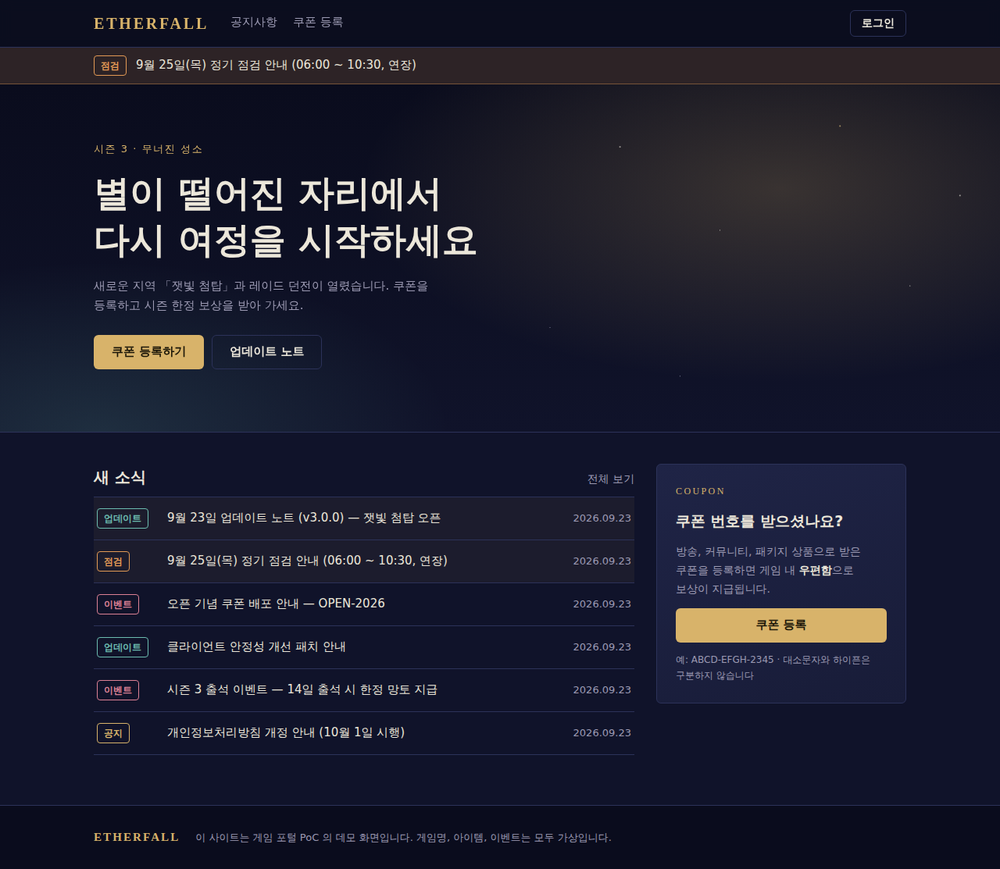 | 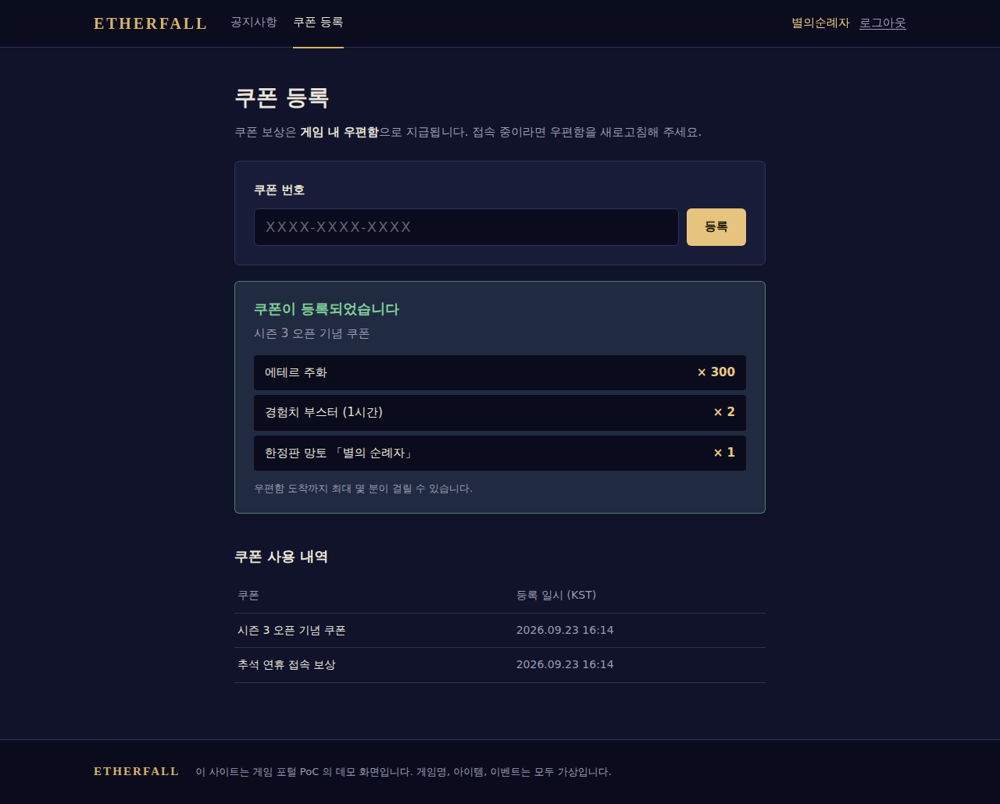 |
| 고정된 점검 공지가 사이트 상단 배너로 노출됩니다. | 보상은 아이템 이름으로 보여 주고, 게임 우편함으로 비동기 지급됩니다. |

| 공지 게시판 | 공지 상세 | 에러 코드별 안내 | 모바일 |
|---|---|---|---|
| 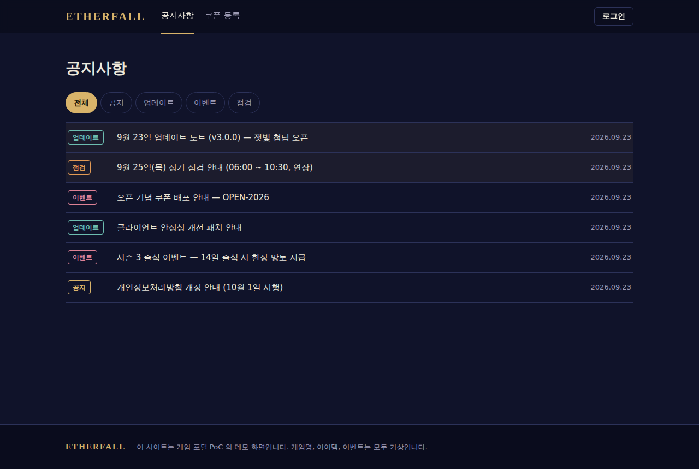 | 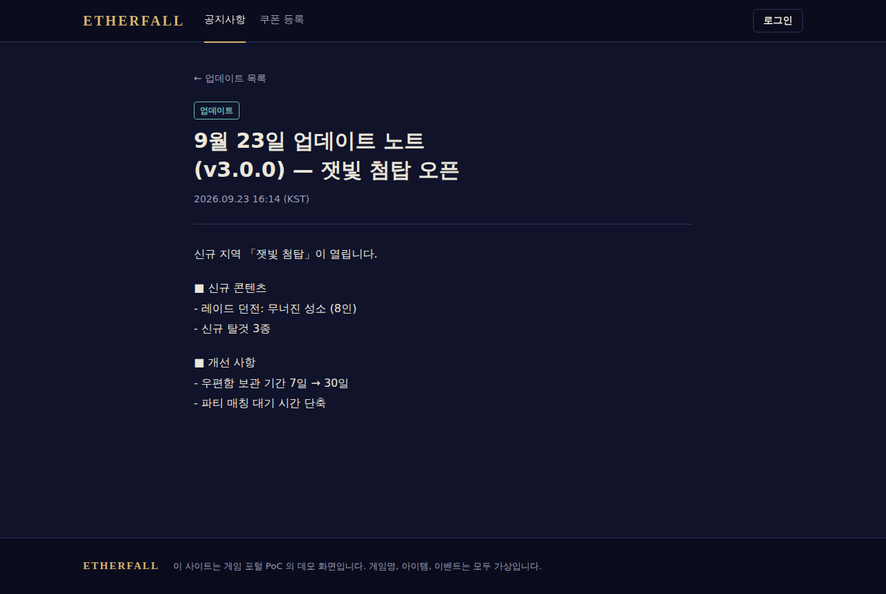 | 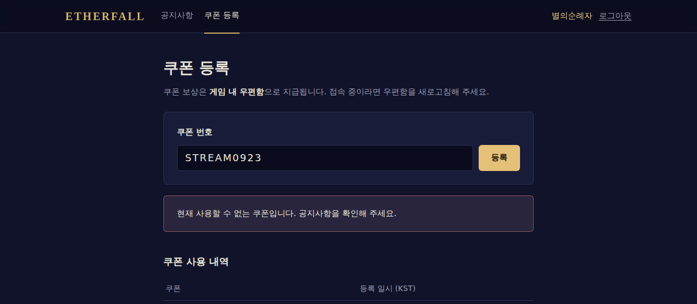 | 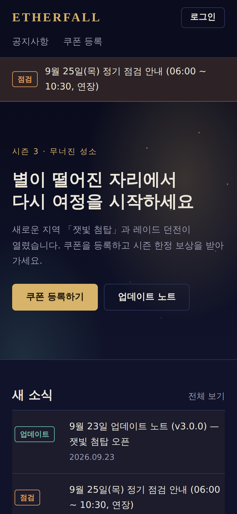 |

### 운영툴 (Next.js)

| 대시보드 | 쿠폰 캠페인 상세 |
|---|---|
|  | 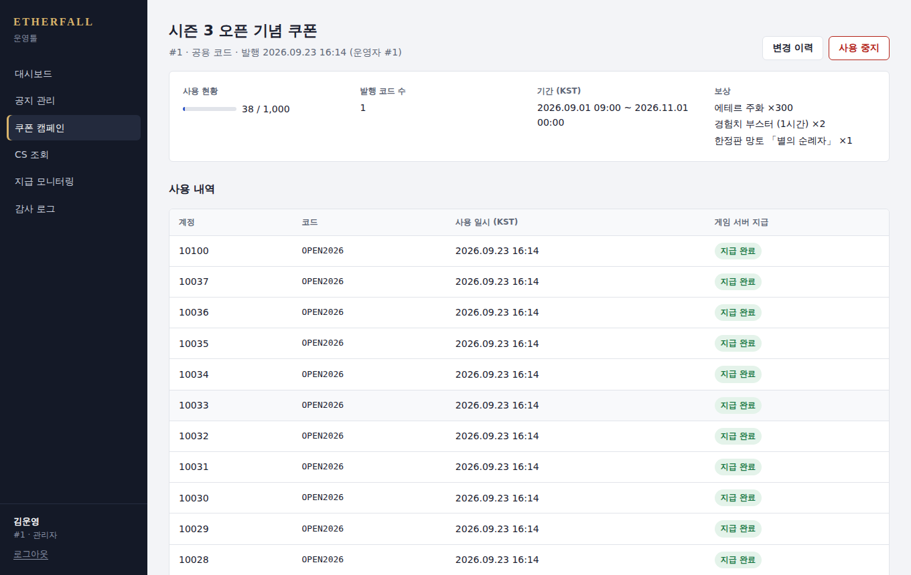 |
| 지급 실패가 있으면 첫 카드가 빨갛게 강조됩니다. | 선착순 소진율, 보상, 사용 건별 게임 서버 지급 상태를 보여 주고, 버튼 하나로 사용을 중지할 수 있습니다. |

| 쿠폰 발행 | CS 조회 |
|---|---|
|  | 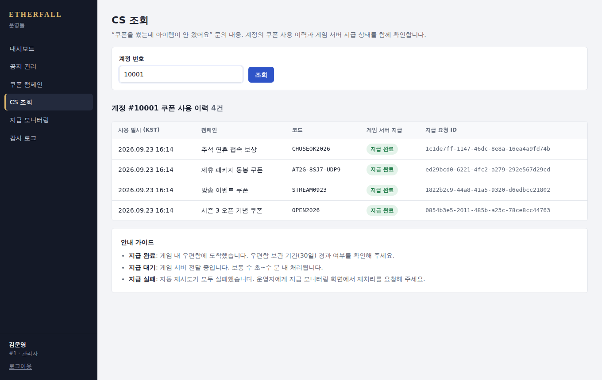 |
| 공용 코드 또는 고유 코드(최대 10만 개)를 발행합니다. 발행 직전에 요약을 한 번 더 확인받습니다. | "쿠폰 썼는데 아이템이 안 왔어요" 문의를 계정 번호 하나로 확인합니다. |

| 지급 모니터링 (Dead letter) | 감사 로그 |
|---|---|
| 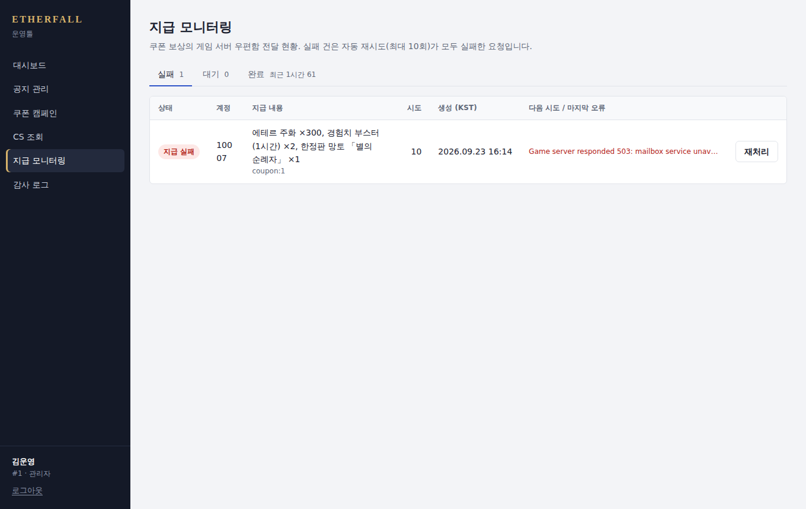 |  |
| 자동 재시도가 모두 실패한 지급 건을 클릭 한 번으로 재처리합니다. | 운영 데이터의 모든 변경을 사람이 읽을 수 있는 형태로 이전 → 이후로 보여 줍니다. |

<details>
<summary>화면 더 보기</summary>

| 로그인 (개발용, 역할 선택) | 공지 관리 | 공지 수정 | 캠페인 목록 |
|---|---|---|---|
| 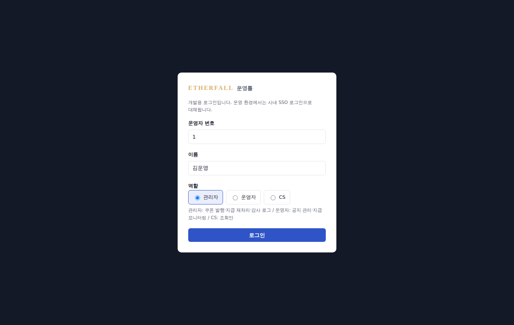 | 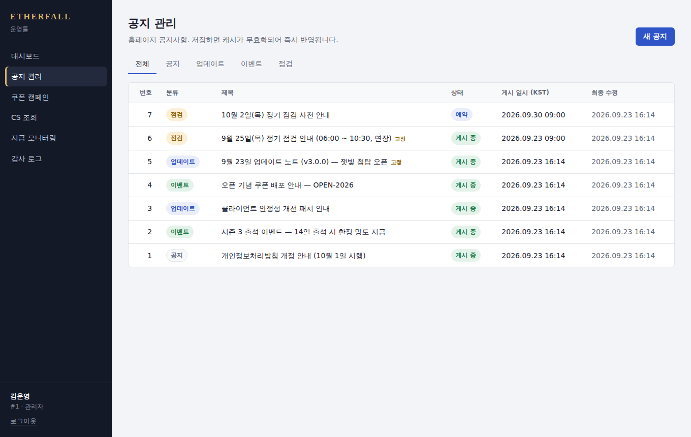 | 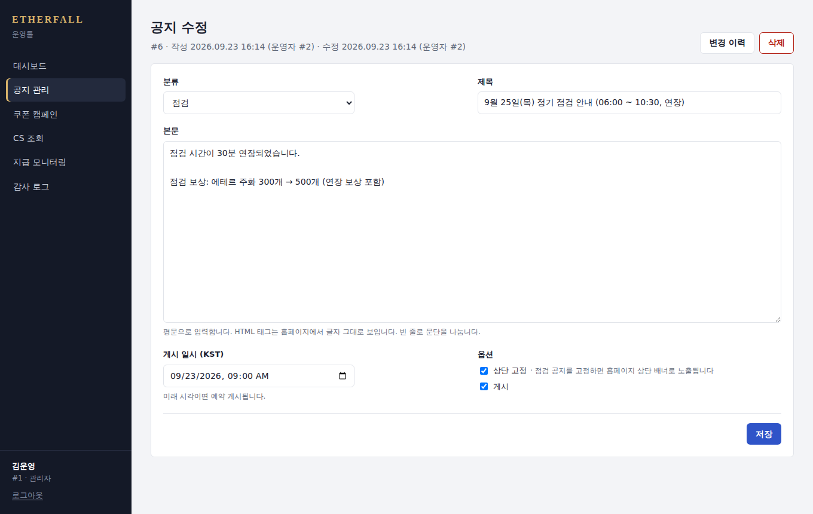 | 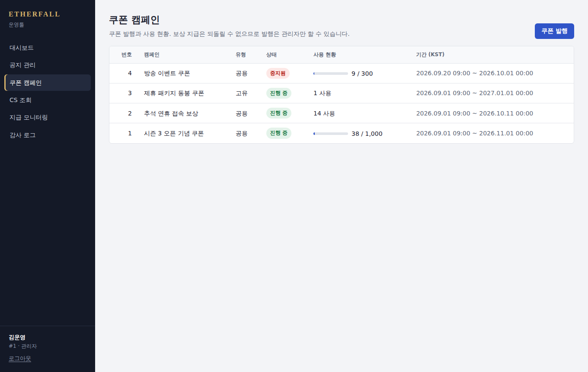 |

</details>

---

## 시스템 구조

### 전체 구성

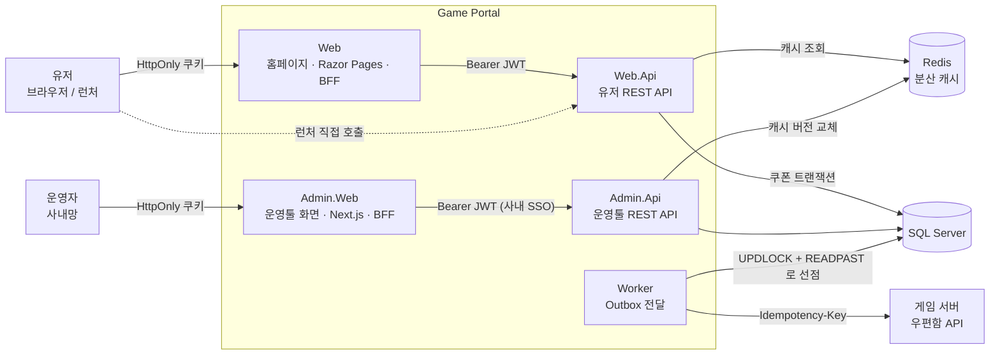
```mermaid
flowchart LR
    Player["유저<br/>브라우저 / 런처"]
    Operator["운영자<br/>사내망"]

    subgraph Portal["Game Portal"]
        Web["Web<br/>홈페이지 · Razor Pages · BFF"]
        WebApi["Web.Api<br/>유저 REST API"]
        AdminWeb["Admin.Web<br/>운영툴 화면 · Next.js · BFF"]
        AdminApi["Admin.Api<br/>운영툴 REST API"]
        Worker["Worker<br/>Outbox 전달"]
    end

    DB[("SQL Server")]
    Redis[("Redis<br/>분산 캐시")]
    Game["게임 서버<br/>우편함 API"]

    Player -- "HttpOnly 쿠키" --> Web
    Web -- "Bearer JWT" --> WebApi
    Player -. "런처 직접 호출" .-> WebApi
    Operator -- "HttpOnly 쿠키" --> AdminWeb
    AdminWeb -- "Bearer JWT (사내 SSO)" --> AdminApi
    WebApi -- "쿠폰 트랜잭션" --> DB
    WebApi -- "캐시 조회" --> Redis
    AdminApi --> DB
    AdminApi -- "캐시 버전 교체" --> Redis
    Worker -- "UPDLOCK + READPAST 로 선점" --> DB
    Worker -- "Idempotency-Key" --> Game
```

| 프로세스 | 역할 | 확장 방식 |
|---|---|---|
| **Web** | 유저 화면: 메인, 공지 게시판, 쿠폰 등록. Web.Api만 호출 | 무상태, 수평 확장 |
| **Web.Api** | 공지 조회(캐시), 쿠폰 사용, 사용 내역, 요청 수 제한 | 무상태, 수평 확장. 트래픽 대부분을 받음 |
| **Admin.Web** | 운영툴 화면. Server Component와 Server Action이 서버에서 Admin.Api를 호출 | 사내망, 1~2대 |
| **Admin.Api** | 공지 관리, 쿠폰 대량 발행, CS 조회, 지급 재처리, 감사 로그, 역할별 권한 | 사내망, 1~2대 |
| **Worker** | Outbox 메시지를 게임 서버로 전달하고 실패 시 재시도 | 수평 확장. 행 잠금으로 중복 처리 방지 |

프로세스를 나눈 이유:
- **보안 경계:** 운영 API가 유저 API와 같은 프로세스에 있지 않으므로, 라우팅 실수 하나로 외부에 노출될 일이 없습니다.
- **장애 격리:** 게임 서버는 Worker만 호출하므로, 게임 서버가 느려져도 웹 응답은 영향을 받지 않습니다.
- **독립 배포:** 운영툴 기능을 추가해도 유저 트래픽을 받는 서버를 다시 배포할 필요가 없습니다.

### 쿠폰 사용: 클릭부터 게임 우편함까지

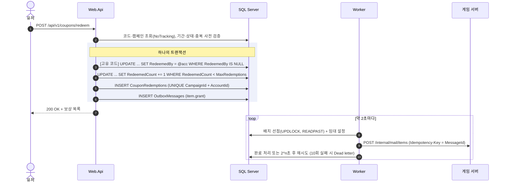
```mermaid
sequenceDiagram
    autonumber
    actor P as 유저
    participant W as Web.Api
    participant DB as SQL Server
    participant K as Worker
    participant G as 게임 서버

    P->>W: POST /api/v1/coupons/redeem
    W->>DB: 코드·캠페인 조회(NoTracking), 기간·상태·중복 사전 검증
    rect rgba(47, 84, 200, 0.08)
    Note over W,DB: 하나의 트랜잭션
    W->>DB: [고유 코드] UPDATE ... SET RedeemedBy = @acc WHERE RedeemedBy IS NULL
    W->>DB: UPDATE ... SET RedeemedCount += 1 WHERE RedeemedCount < MaxRedemptions
    W->>DB: INSERT CouponRedemptions (UNIQUE CampaignId + AccountId)
    W->>DB: INSERT OutboxMessages (item.grant)
    end
    W-->>P: 200 OK + 보상 목록
    loop 약 2초마다
        K->>DB: 배치 선점(UPDLOCK, READPAST) + 임대 설정
        K->>G: POST /internal/mail/items (Idempotency-Key = MessageId)
        K->>DB: 완료 처리 또는 2^n초 후 재시도 (10회 실패 시 Dead letter)
    end
```

| 보장할 규칙 | 구현 | 실패 시 에러 코드 |
|---|---|---|
| 선착순 총 수량 | 조건부 `UPDATE`(원자적 증가). 영향 행이 0이면 소진 | `COUPON_SOLD_OUT` |
| 고유 코드 1회 사용 | 조건부 `UPDATE`로 코드 선점 | `COUPON_ALREADY_USED` |
| 계정당 1회 | `UNIQUE (CampaignId, AccountId)` | `COUPON_ALREADY_REDEEMED` |
| 부분 성공 금지 | 위 규칙 + 사용 이력 + Outbox를 하나의 트랜잭션으로 | 롤백 시 수량 증가도 취소 |
| 중복 지급 금지 | Outbox `MessageId`를 게임 서버 멱등키로 전달 | 409는 성공으로 간주 |

게임 서버 호출을 트랜잭션 안에서 하지 않는 이유가 있습니다. 게임 서버가 느리면 DB 락이 길어지고, 호출은 성공했는데 커밋이 실패하면 아이템이 무상 지급됩니다. 반대로 커밋 후에 호출하면 프로세스가 죽을 때 지급이 누락됩니다. **Transactional Outbox**는 두 문제를 모두 피합니다.

### 공지 캐시와 프로세스 간 무효화

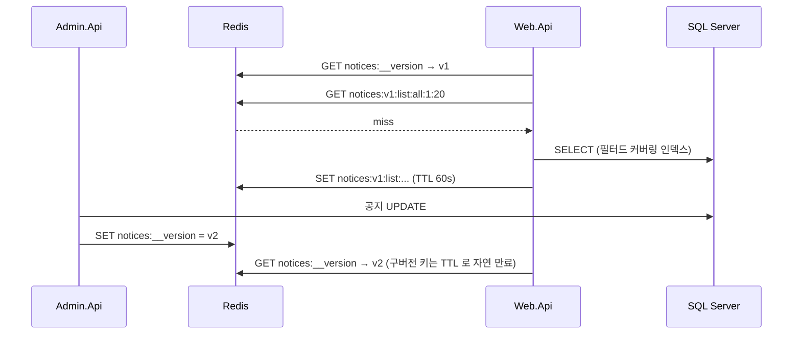
```mermaid
sequenceDiagram
    participant O as Admin.Api
    participant R as Redis
    participant W as Web.Api
    participant DB as SQL Server

    W->>R: GET notices:__version → v1
    W->>R: GET notices:v1:list:all:1:20
    R-->>W: miss
    W->>DB: SELECT (필터드 커버링 인덱스)
    W->>R: SET notices:v1:list:... (TTL 60s)
    O->>DB: 공지 UPDATE
    O->>R: SET notices:__version = v2
    W->>R: GET notices:__version → v2 (구버전 키는 TTL 로 자연 만료)
```

- **키 스캔 없음:** `SCAN` + `DEL`로 키를 찾아 지우지 않고 버전 키 하나만 교체합니다. 트래픽이 많은 Redis에서 키 스캔은 부하가 큽니다.
- **Fail-open:** Redis가 죽으면 페이지를 실패시키지 않고 DB로 폴백합니다.
- **Negative caching:** 존재하지 않는 공지 ID도 캐싱해서 크롤러가 DB를 반복 조회하지 못하게 합니다.

### 코드 레이어

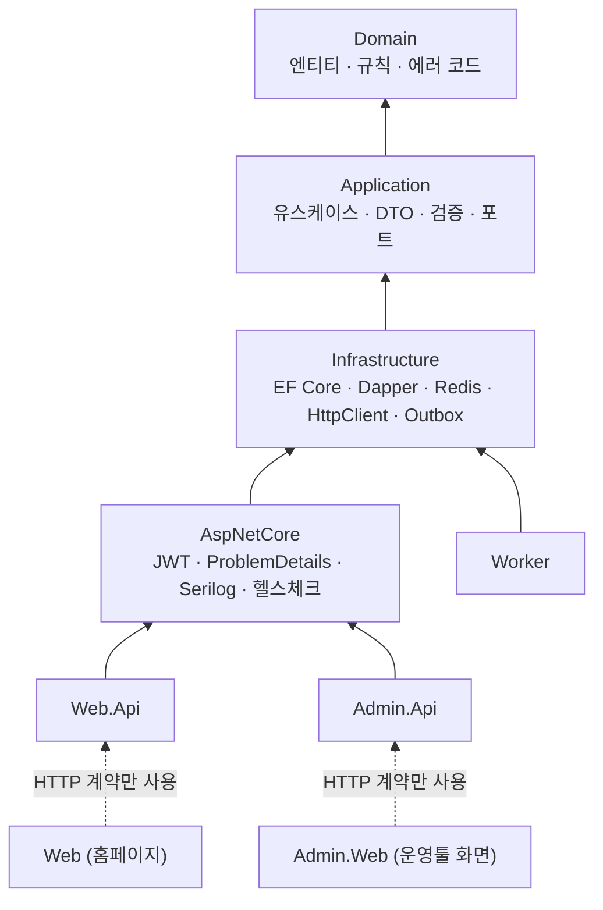
```mermaid
flowchart BT
    Domain["Domain<br/>엔티티 · 규칙 · 에러 코드"]
    App["Application<br/>유스케이스 · DTO · 검증 · 포트"]
    Infra["Infrastructure<br/>EF Core · Dapper · Redis · HttpClient · Outbox"]
    Host["AspNetCore<br/>JWT · ProblemDetails · Serilog · 헬스체크"]
    WebApi["Web.Api"]
    AdminApi["Admin.Api"]
    Worker["Worker"]
    Web["Web (홈페이지)"]
    AdminWeb["Admin.Web (운영툴 화면)"]

    App --> Domain
    Infra --> App
    Host --> Infra
    WebApi --> Host
    AdminApi --> Host
    Worker --> Infra
    Web -. "HTTP 계약만 사용" .-> WebApi
    AdminWeb -. "HTTP 계약만 사용" .-> AdminApi
```

두 화면 프로젝트는 서버 프로젝트를 하나도 참조하지 않고 HTTP 계약만 사용하므로, 각각 독립적으로 배포할 수 있습니다.

### 데이터 모델

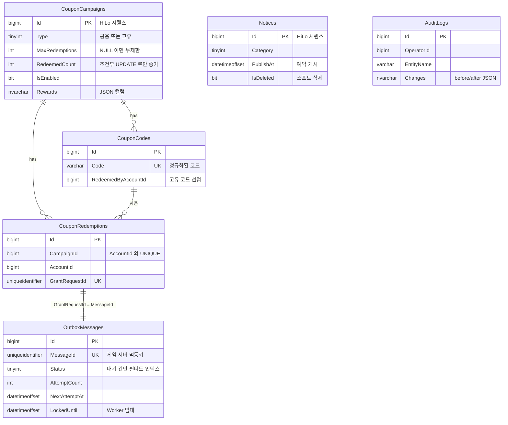
```mermaid
erDiagram
    CouponCampaigns ||--o{ CouponCodes : has
    CouponCampaigns ||--o{ CouponRedemptions : has
    CouponCodes ||--o{ CouponRedemptions : "사용"
    CouponRedemptions ||--|| OutboxMessages : "GrantRequestId = MessageId"

    CouponCampaigns {
        bigint Id PK "HiLo 시퀀스"
        tinyint Type "공용 또는 고유"
        int MaxRedemptions "NULL 이면 무제한"
        int RedeemedCount "조건부 UPDATE 로만 증가"
        bit IsEnabled
        nvarchar Rewards "JSON 컬럼"
    }
    CouponCodes {
        bigint Id PK
        varchar Code UK "정규화된 코드"
        bigint RedeemedByAccountId "고유 코드 선점"
    }
    CouponRedemptions {
        bigint Id PK
        bigint CampaignId "AccountId 와 UNIQUE"
        bigint AccountId
        uniqueidentifier GrantRequestId UK
    }
    OutboxMessages {
        bigint Id PK
        uniqueidentifier MessageId UK "게임 서버 멱등키"
        tinyint Status "대기 건만 필터드 인덱스"
        int AttemptCount
        datetimeoffset NextAttemptAt
        datetimeoffset LockedUntil "Worker 임대"
    }
    Notices {
        bigint Id PK "HiLo 시퀀스"
        tinyint Category
        datetimeoffset PublishAt "예약 게시"
        bit IsDeleted "소프트 삭제"
    }
    AuditLogs {
        bigint Id PK
        bigint OperatorId
        varchar EntityName
        nvarchar Changes "before/after JSON"
    }
```

### CI/CD

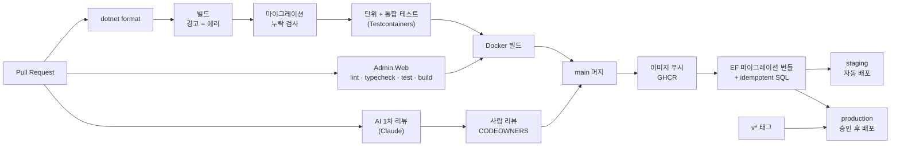
```mermaid
flowchart LR
    PR["Pull Request"] --> Fmt["dotnet format"] --> Build["빌드<br/>경고 = 에러"] --> Mig["마이그레이션<br/>누락 검사"] --> Tests["단위 + 통합 테스트<br/>(Testcontainers)"] --> Docker["Docker 빌드"]
    PR --> FE["Admin.Web<br/>lint · typecheck · test · build"] --> Docker
    PR --> AI["AI 1차 리뷰<br/>(Claude)"] --> Human["사람 리뷰<br/>CODEOWNERS"]
    Docker --> Merge["main 머지"]
    Human --> Merge
    Merge --> Push["이미지 푸시<br/>GHCR"] --> Bundle["EF 마이그레이션 번들<br/>+ idempotent SQL"] --> Staging["staging<br/>자동 배포"]
    Tag["v* 태그"] --> Prod["production<br/>승인 후 배포"]
    Bundle --> Prod
```

DB 스키마 변경은 앱 배포와 분리된 단계에서 실행합니다. EF 마이그레이션 번들과, DBA가 검토할 수 있는 idempotent SQL을 산출물로 남깁니다. 앱 기동 시 자동 마이그레이션은 로컬 개발에서만 켭니다.

---

## 핵심 설계 결정

| 영역 | 결정 | 이유 |
|---|---|---|
| 동시성 | "조회 후 수정" 대신 조건부 `UPDATE`와 `UNIQUE` 제약 | 선착순 이벤트에서 조회 후 수정은 Lost Update로 초과 지급을 일으킴 |
| 외부 연동 | Transactional Outbox, 멱등키, 2단 재시도(Polly → 지수 백오프 → Dead letter) | 웹 DB와 게임 서버 사이에는 분산 트랜잭션을 걸 수 없음 |
| 데이터 접근 | CRUD는 EF Core, 락 힌트가 필요한 Outbox 선점만 Dapper. Repository 계층을 한 겹 더 두지 않음 | `DbContext`가 이미 Unit of Work이고, `IQueryable`을 감추면 쿼리 튜닝이 어려워짐 |
| 감사 로그 | `SaveChangesInterceptor`가 같은 트랜잭션으로 기록. HiLo로 `INSERT` 전에 Id 확정 | 서비스 코드에서 직접 남기면 누락이 생김 |
| 인증 | 두 화면 모두 BFF. 토큰은 HttpOnly 쿠키에만 두고 API는 서버에서 호출 | XSS로 토큰을 훔칠 수 없고, API 주소도 브라우저에 노출되지 않음 |
| 에러 | RFC 7807 ProblemDetails + 고정된 `code` + `traceId` | 클라이언트는 문구가 아닌 코드로 분기하고, CS는 추적 ID로 로그를 찾음 |
| 계약 | 서버에 쿠폰 에러 코드가 추가됐는데 홈페이지 문구가 없으면 단위 테스트가 실패 | 화면 문구와 서버 계약이 어긋나지 않게 유지 |
| 운영 UX | 발행 전 요약 확인, 제출 중 버튼 잠금, 모든 시각 KST, 감사 로그 원시값 변환 | 운영자는 되돌리기 어려운 작업을 하고, 감사 로그를 빠르게 읽어야 함 |
| 한국어 처리 | 어절 단위 줄바꿈(`word-break: keep-all`), 한글이 HTML 엔티티로 인코딩되지 않도록 설정 | 한국어 사이트의 흔한 함정. 둘 다 개발 중에 발견해서 고침 |

### 채용공고 ↔ PoC 매핑

| 채용공고 항목 | PoC에서 보여 주는 것 |
|---|---|
| 게임에 필요한 웹사이트 유지보수 및 신규 개발 | `src/GamePortal.Web` (서버 렌더링, 반응형, 검색 노출용 공지) + `src/GamePortal.Web.Api` |
| 웹사이트 관리 운영툴 유지보수 및 신규 개발 | `src/GamePortal.Admin.Web` (Next.js) + `src/GamePortal.Admin.Api` (권한, 감사 로그, 대량 발행, CSV 스트리밍) |
| .NET 6.0 이상 웹서비스 개발 | .NET 8, ASP.NET Core, EF Core 8, `IExceptionHandler`, `TimeProvider`, Rate Limiter, typed `HttpClient` + resilience |
| RDBMS 개발 및 운영 | SQL Server: 조건부 UPDATE, UNIQUE 제약, 필터드/커버링 인덱스, HiLo, JSON 컬럼, `UPDLOCK + READPAST`, 마이그레이션 |
| RESTful API 설계 및 개발 | 리소스 중심 URL, 상태 코드 규약, ProblemDetails + 에러 코드, 페이징, 멱등키 |
| 서버 아키텍처 및 데이터 흐름 | Web / Admin / Worker 분리, Transactional Outbox, 캐시 무효화 (위 구조도) |
| Git을 이용한 프로젝트 관리 | GitHub Flow, Conventional Commits, PR 템플릿, CODEOWNERS, Dependabot |
| (우대) 코드 리뷰 문화, 개발 프로세스 개선 | 리뷰 체크리스트와 코멘트 등급, CI가 강제하는 스타일 검사, 마이그레이션 누락 검사 |
| (우대) 대용량 웹서비스 | 동시성 안전한 선착순, Redis 캐시, Rate limiting, 스트리밍, 확장 로드맵 |
| (우대) CI/CD 배포 자동화 | GitHub Actions CI/CD, GHCR 이미지, 마이그레이션 번들, staging 자동 배포, production 승인 배포 |
| (우대) AI 도구의 실무 통합 | PR AI 리뷰 워크플로, 에이전트용 `CLAUDE.md`, `CONTRIBUTING.md`의 AI 활용 가이드 |

---

## 실행

```bash
docker compose up --build
```

| 서비스 | 주소 | 참고 |
|---|---|---|
| 게임 홈페이지 | http://localhost:5000 | 개발용 로그인: 아무 계정 번호나 입력 |
| 운영툴 | http://localhost:3000 | 개발용 로그인: 역할 선택 (관리자 / 운영자 / CS) |
| Web API | http://localhost:5100/swagger | |
| Admin API | http://localhost:5200/swagger | 기동 시 마이그레이션 적용 (로컬 전용) |
| 게임 서버 목 | http://localhost:5300 | 20% 확률로 503을 돌려줘서 재시도 흐름을 확인할 수 있음 |

주요 흐름 따라 해 보기:
1. 운영툴에 **관리자**로 로그인하고 **쿠폰 캠페인 → 쿠폰 발행**에서 `OPEN2026` 같은 공용 코드를 발행합니다.
2. 홈페이지에 로그인해서 **쿠폰 등록**에 `open-2026`을 입력합니다. 대소문자와 하이픈은 구분하지 않습니다.
3. 운영툴 **CS 조회**에 계정 번호를 입력하면 지급 상태가 *지급 대기*에서 *지급 완료*로 바뀌는 것을 볼 수 있습니다.
4. **감사 로그**에서 누가 어떤 보상으로 캠페인을 발행했는지 확인합니다.

<details>
<summary>같은 흐름을 curl로</summary>

```bash
ADMIN=$(curl -s -X POST localhost:5200/dev/token -H 'content-type: application/json' \
  -d '{"operatorId":1,"name":"운영자","roles":["Admin"]}' | jq -r .accessToken)

curl -X POST localhost:5200/api/v1/coupon-campaigns -H "authorization: Bearer $ADMIN" -H 'content-type: application/json' -d '{
  "name":"오픈 기념","type":"Shared","startsAt":"2026-01-01T00:00:00Z","endsAt":"2027-01-01T00:00:00Z",
  "maxRedemptions":100,"rewards":[{"itemId":1001,"quantity":100}],"sharedCode":"OPEN2026"}'

PLAYER=$(curl -s -X POST localhost:5100/dev/token -H 'content-type: application/json' -d '{"accountId":10001}' | jq -r .accessToken)
curl -X POST localhost:5100/api/v1/coupons/redeem -H "authorization: Bearer $PLAYER" \
  -H 'content-type: application/json' -d '{"code":"open-2026"}'

curl "localhost:5200/api/v1/coupon-redemptions?accountId=10001" -H "authorization: Bearer $ADMIN"
```
</details>

### JetBrains Rider / WebStorm으로 로컬 실행

저장소에 공유 실행 설정([`.run/`](.run))이 들어 있어서, Rider로 `GamePortal.sln`을 열면 자동으로 인식됩니다.

**준비물:** .NET 8 SDK, Node.js 22, Docker Desktop, Rider. Next.js 운영툴은 Rider에 내장된 JavaScript 지원으로 실행됩니다.

1. **인프라 실행:** **`0. Infra (SQL Server + Redis)`**를 실행하거나, 터미널에서 `docker compose up -d sqlserver redis`를 실행합니다.
2. **프론트엔드 패키지 설치 (최초 1회):** `src/GamePortal.Admin.Web`에서 `npm install`을 실행합니다. `package.json`을 열면 Rider가 설치를 제안하기도 합니다.
3. **전체 실행:** **`All services`**를 Run 또는 Debug로 실행합니다. 아래 실행 설정이 함께 뜹니다.

| 실행 설정 | 주소 | 참고 |
|---|---|---|
| `1. Admin.Api` | http://localhost:5200/swagger | 기동 시 DB 마이그레이션 적용 (Development 전용) |
| `2. Web.Api` | http://localhost:5100/swagger | |
| `3. Web (homepage)` | http://localhost:5000 | |
| `4. Worker` | – | 쿠폰 보상을 게임 서버 목으로 전달 |
| `5. GameServer.Mock` | http://localhost:5300 | |
| `6. Admin.Web (ops UI)` | http://localhost:3000 | `npm run dev`. 커밋된 `.env.development` 설정을 사용 |

4. **IDE에서 흐름 따라 해 보기:** [`tools/http/demo.http`](tools/http/demo.http)를 열고 환경을 `local`로 고른 뒤 *Run All Requests in File*을 실행합니다. 로그인 → 공지 등록 → 쿠폰 발행 → 쿠폰 사용 → CS 조회 → 감사 로그 순서로 진행하면서, 각 단계의 기대 상태 코드를 자동으로 검사합니다.

서비스를 넘나드는 디버깅도 됩니다. `All services`를 **Debug**로 실행하고 `CouponRedeemService`와 `OutboxProcessor` 등에 중단점을 걸면, 쿠폰 하나가 HTTP 요청에서 게임 서버 호출까지 가는 과정을 따라갈 수 있습니다.

<details>
<summary>문제 해결</summary>

- **Apple Silicon (M1~M4):** SQL Server 2022는 x86-64 이미지만 있습니다. *Docker Desktop → Settings → General → Use Rosetta for x86/amd64 emulation*을 켜 주세요.
- **`0. Infra`에서 "Docker" 서버를 찾을 수 없다는 오류:** 실행 설정에서 본인의 Docker 연결을 선택하거나, 터미널에서 컨테이너를 띄워 주세요.
- **운영툴을 WebStorm으로 여는 경우:** `src/GamePortal.Admin.Web` 폴더를 열고 `package.json`의 `dev` 스크립트를 실행합니다. .NET 서비스는 Rider나 `docker compose up`으로 따로 띄워야 합니다.
- **포트가 이미 사용 중인 경우:** `docker compose`로 띄운 앱 컨테이너를 먼저 멈추세요. 로컬 실행에서는 `sqlserver`와 `redis`만 Docker로 띄웁니다.
- **`global.json` 관련 SDK 오류:** .NET 8 SDK를 설치해 주세요. 이 저장소는 메이저 버전 8로 고정되어 있습니다.

</details>

---

## 테스트

| 테스트 | 개수 | 검증하는 것 |
|---|---:|---|
| .NET 단위 (`tests/GamePortal.UnitTests`) | 56 | 도메인 규칙과 경계값, 검증기, 캐시 폴백, 홈페이지 ↔ 서버 에러 코드 계약 |
| .NET 통합 (`tests/GamePortal.IntegrationTests`) | 33 | Testcontainers로 띄운 실제 SQL Server에서 API와 Razor 홈페이지를 전 구간 실행 |
| 운영툴 단위 (`npm test`) | 13 | KST 변환, 에러 매핑, 역할 규칙, 감사 로그 표시 변환 |
| 운영툴 E2E (`npm run e2e`) | 4 | 전체 스택을 띄운 상태에서 Playwright로 실행. 실제 Worker 전달까지 포함 |

주요 보장:
- 선착순 10개 쿠폰에 40명이 동시에 요청하면 **정확히 10명**만 성공하고, 나머지는 `COUPON_SOLD_OUT`을 받습니다.
- 같은 계정이 동시에 5번 요청하면 1번만 성공하고, 나머지 요청의 수량 증가는 **롤백**됩니다.
- Worker 4대가 동시에 처리해도 모든 메시지가 **정확히 한 번만** 전달됩니다.
- 운영자가 공지를 수정하면 홈페이지 캐시가 즉시 무효화되고, 감사 로그에는 바뀐 컬럼만 기록됩니다.
- 발행 → 유저 사용 → CS 조회 "지급 완료" → 사용 중지 → 감사 로그 흐름을 실제 화면으로 검증합니다(E2E).

```bash
dotnet test tests/GamePortal.UnitTests
dotnet test tests/GamePortal.IntegrationTests      # Docker 필요

cd src/GamePortal.Admin.Web
npm test
npm run e2e                                        # docker compose up 으로 스택 실행 후
```

---

## 프로젝트 구조

```
src/
  GamePortal.Domain           엔티티, 비즈니스 규칙, 에러 코드 (외부 의존성 없음)
  GamePortal.Application      유스케이스, DTO, FluentValidation, 포트 인터페이스
  GamePortal.Infrastructure   EF Core(SQL Server), Dapper, Redis, 게임 서버 클라이언트, Outbox, 감사 인터셉터
  GamePortal.AspNetCore       두 API 공통: JWT, ProblemDetails, Serilog, 헬스체크, Swagger
  GamePortal.Web              게임 홈페이지 (Razor Pages, BFF)
  GamePortal.Web.Api          유저 REST API (+ Rate limiting)
  GamePortal.Admin.Web        운영툴 화면 (Next.js App Router, BFF)
  GamePortal.Admin.Api        운영툴 REST API (+ 역할 정책, 감사 로그)
  GamePortal.Worker           Outbox → 게임 서버 전달
tools/GameServer.Mock         장애 주입이 가능한 게임 우편함 API 목
tools/http/demo.http          JetBrains HTTP Client용 전체 흐름 데모 시나리오
.run/                         Rider 공유 실행 설정 (인프라, 서비스별, "All services")
tests/                        .NET 단위·통합 테스트
docs/                         설계 문서, 코드 리뷰 가이드, 스크린샷
.github/                      CI, CD, AI 리뷰, PR 템플릿, CODEOWNERS, Dependabot
```

## API 요약

**Web API** (`/api/v1`)

| Method | Path | 설명 |
|---|---|---|
| GET | `/notices?category=&page=&pageSize=` | 공지 목록 (고정글 우선) |
| GET | `/notices/{id}` | 공지 상세 |
| POST | `/coupons/redeem` | 쿠폰 사용 (로그인 필요, 계정당 분당 10회) |
| GET | `/coupons/history` | 내 쿠폰 사용 내역 (로그인 필요) |

**Admin API** (`/api/v1`). 역할: `CS` < `Operator` < `Admin`

| Method | Path | 권한 |
|---|---|---|
| GET/POST/PUT/DELETE | `/notices[/{id}]` | 조회: 전체. 변경: Operator 이상 |
| GET | `/coupon-campaigns[/{id}]` | 전체 |
| POST | `/coupon-campaigns` · `/{id}/disable` · `/{id}/enable` | Admin |
| GET | `/coupon-campaigns/{id}/codes.csv` | Admin (스트리밍) |
| GET | `/coupon-redemptions?accountId=&campaignId=` | 전체 (CS 조회) |
| GET | `/outbox/stats` · `/outbox?status=` | Operator 이상 |
| POST | `/outbox/{id}/retry` | Admin |
| GET | `/audit-logs?entityName=&entityId=&operatorId=&from=&to=` | Admin |

에러 형식 (RFC 7807):

```json
{ "status": 409, "code": "COUPON_SOLD_OUT", "title": "선착순 수량이 모두 소진되었습니다.",
  "instance": "/api/v1/coupons/redeem", "traceId": "4bf92f3577b34da6a3ce929d0e0e4736" }
```

---

## 개발 프로세스

- **스타일은 기계가 검사:** `.editorconfig`, `dotnet format`, 경고를 에러로 처리하는 CI, 프론트엔드는 경고 0개 ESLint. 리뷰는 설계에 집중합니다.
- **AI를 활용한 개발:** 모든 PR은 [docs/CODE_REVIEW.md](docs/CODE_REVIEW.md) 체크리스트 기준으로 Claude의 1차 리뷰를 받습니다. [CLAUDE.md](CLAUDE.md)는 코딩 에이전트에게 사람과 같은 규칙을 제공합니다. PR 템플릿에서 AI 사용 범위를 밝히도록 합니다.
- **안전한 스키마 변경:** 엔티티를 바꾸고 마이그레이션을 빠뜨리면 CI가 실패합니다. 마이그레이션은 번들과 검토 가능한 SQL 스크립트로 배포합니다.
- **저장소 관리:** GitHub Flow, Conventional Commits, 재화 관련 경로에 CODEOWNERS 지정, Dependabot.

## PoC 범위 밖

- 실제 사내 SSO / 게임 플랫폼 로그인 연동. `Jwt:Authority` 설정만으로 전환할 수 있게 구성했고, 로컬에서는 개발용 토큰을 씁니다.
- Playwright E2E의 CI 실행. 전체 스택이 필요해서 현재는 로컬에서 실행합니다.
- 쿠버네티스 매니페스트와 IaC. CD 워크플로에 배포 단계만 정의했고 `DEPLOY_ENABLED` 변수로 켭니다.
