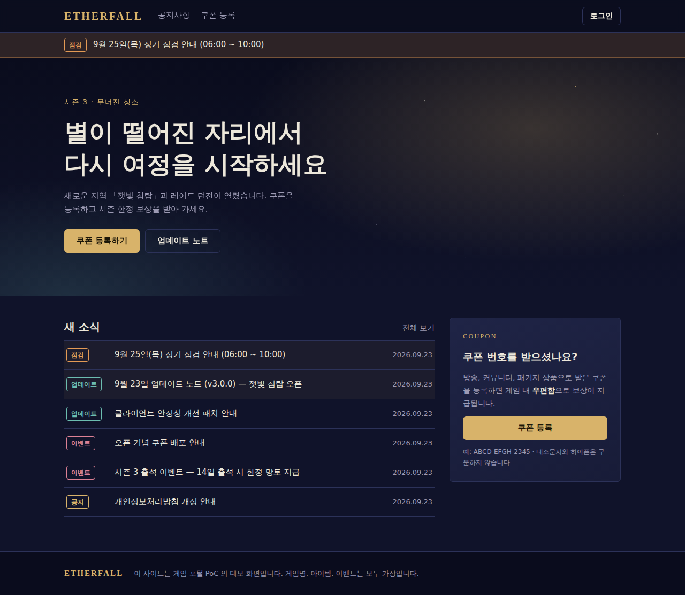
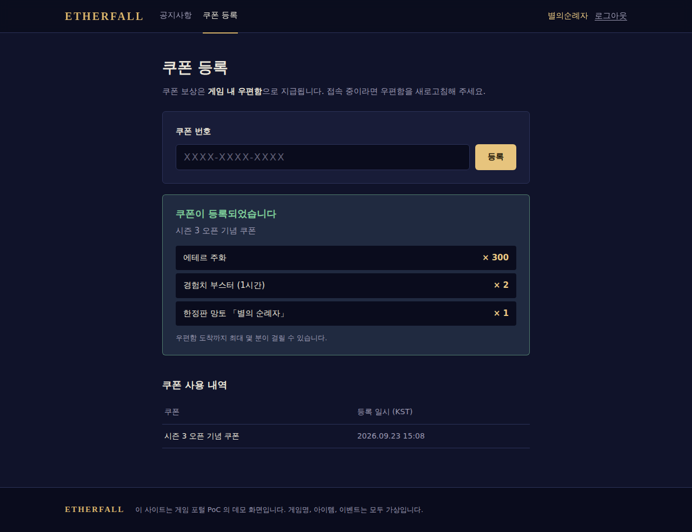
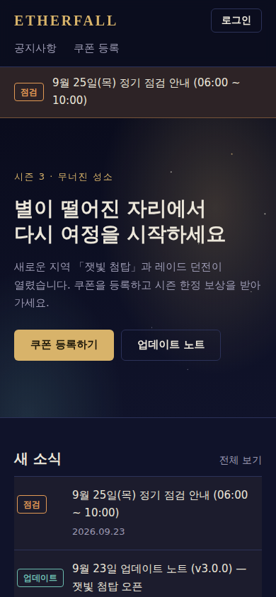
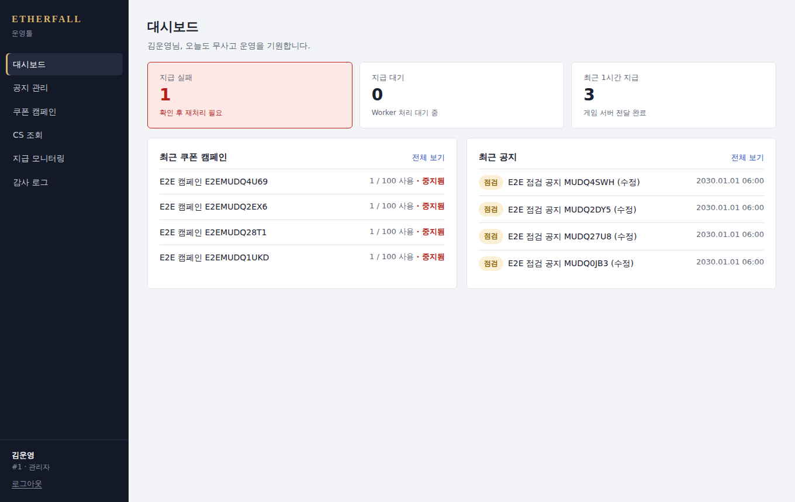
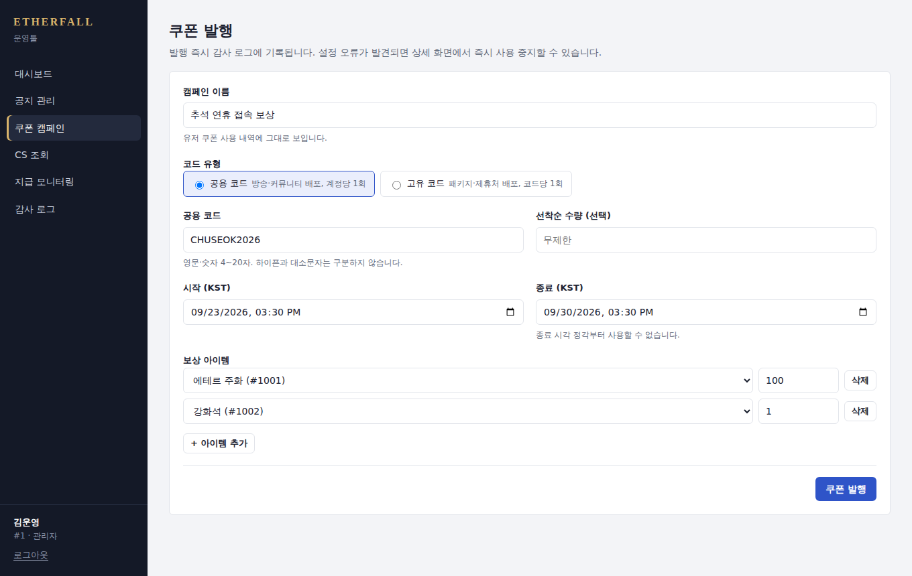
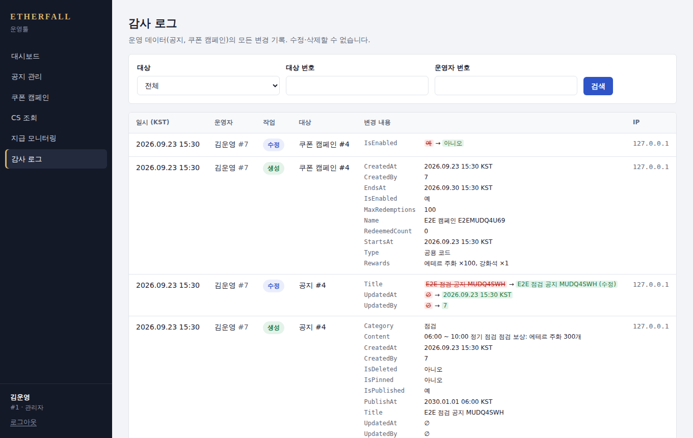

# Game Portal PoC

게임 홈페이지 + 운영툴 풀스택 PoC (.NET 8 / Razor Pages / Next.js / SQL Server / Redis / GitHub Actions)

"**쿠폰 입력 → 게임 내 우편함 지급**", "**운영툴에서 공지 작성 → 홈페이지 즉시 반영**" 같은
게임 웹서비스의 대표 시나리오를 실무 수준의 **동시성 제어 · 데이터 정합성 · 운영성 · 배포 자동화**로 구현했다.

| 홈페이지 | 쿠폰 등록 | 모바일 |
|---|---|---|
|  |  |  |

| 운영툴 대시보드 | 쿠폰 발행 | 감사 로그 |
|---|---|---|
|  |  |  |

> 설계 상세: [docs/ARCHITECTURE.md](docs/ARCHITECTURE.md) · 리뷰 가이드: [docs/CODE_REVIEW.md](docs/CODE_REVIEW.md) · 개발 프로세스: [CONTRIBUTING.md](CONTRIBUTING.md)

## 채용공고 ↔ PoC 매핑

| 채용공고 항목 | 이 PoC 에서 보여주는 것 | 위치 |
|---|---|---|
| 게임에 필요한 **웹사이트** 개발 | 홈페이지(Razor Pages, 서버 렌더링): 메인·공지 게시판·쿠폰 등록·반응형. 공지 조회(분산 캐시)·쿠폰 사용 API | `src/GamePortal.Web`, `src/GamePortal.Web.Api` |
| 웹사이트 관리 **운영툴** 개발 | 운영툴 화면(Next.js): 대시보드·공지 관리·쿠폰 발행/중지/CSV·CS 조회·지급 재처리·감사 로그, 역할별 메뉴. API: 10만 건 BulkCopy, CSV 스트리밍, 역할 기반 권한 | `src/GamePortal.Admin.Web`, `src/GamePortal.Admin.Api` |
| **.NET 6.0 이상** 웹서비스 | .NET 8, ASP.NET Core, EF Core 8, Minimal hosting, `IExceptionHandler`, `TimeProvider`, Rate Limiter | 전체 |
| **RDBMS** 개발·운영 | SQL Server: 조건부 UPDATE 동시성, UNIQUE 제약, 필터드/커버링 인덱스, HiLo 시퀀스, JSON 컬럼, `UPDLOCK+READPAST`, EF 마이그레이션 | `Infrastructure/Persistence`, `Outbox` |
| **RESTful API** 설계 | 리소스 중심 URL, 상태코드 규약, RFC 7807 ProblemDetails + 에러 코드, 페이징, `Idempotency-Key` | Controllers, `GlobalExceptionHandler` |
| **서버 아키텍처 / 데이터 흐름** | Web / Admin / Worker 분리, Transactional Outbox, 캐시 무효화 흐름 | [ARCHITECTURE.md](docs/ARCHITECTURE.md) |
| **Git** 프로젝트 관리 | GitHub Flow, Conventional Commits, PR 템플릿, CODEOWNERS, Dependabot | `.github/`, `CONTRIBUTING.md` |
| (우대) **코드 리뷰 문화 / 프로세스 개선** | 리뷰 체크리스트·코멘트 등급, 스타일은 CI 가 강제(`dotnet format`, 경고=에러), 마이그레이션 누락 자동 검사 | `docs/CODE_REVIEW.md`, `.editorconfig` |
| (우대) **대용량 웹서비스** | 선착순 동시성, Redis 캐시(fail-open, negative caching), Rate limiting, 스트리밍, 확장 로드맵 | ARCHITECTURE §3, §4, §6 |
| (우대) **CI/CD 배포 자동화** | CI(포맷→빌드→마이그레이션 검사→단위→통합(Testcontainers)→Docker) / CD(GHCR 푸시→EF 번들→staging 자동→prod 승인) | `.github/workflows/` |
| (우대) **AI 도구 실무 통합** | PR 마다 Claude 1차 리뷰, 에이전트용 컨벤션(`CLAUDE.md`), AI 활용 가이드 | `claude-code-review.yml`, `CLAUDE.md` |

## 구조

```
src/
  GamePortal.Domain          엔티티·비즈니스 규칙·에러 코드 (외부 의존성 없음)
  GamePortal.Application     유스케이스 서비스, DTO, FluentValidation, 포트 인터페이스
  GamePortal.Infrastructure  EF Core(SQL Server), Dapper, Redis, 게임서버 HttpClient, Outbox 처리기, 감사 인터셉터
  GamePortal.AspNetCore      두 API 공통: JWT, ProblemDetails, Serilog, 헬스체크, Swagger
  GamePortal.Web             홈페이지 (Razor Pages). Web.Api 를 HTTP 로 호출하는 BFF, 토큰은 HttpOnly 쿠키에만
  GamePortal.Web.Api         유저 대면 API (+ Rate limiting)
  GamePortal.Admin.Web       운영툴 화면 (Next.js App Router). Admin.Api 를 서버에서 호출하는 BFF, 토큰은 httpOnly 쿠키에만
  GamePortal.Admin.Api       운영툴 API (+ 역할 기반 권한, 감사 로그)
  GamePortal.Worker          Outbox → 게임 서버 우편함 전달
tools/GameServer.Mock        게임 서버 우편함 API 목 (장애 주입 가능)
tests/
  GamePortal.UnitTests         도메인 규칙, 검증기, 캐시 폴백, 프론트-서버 에러코드 계약 (56개)
  GamePortal.IntegrationTests  실제 SQL Server(Testcontainers) + WebApplicationFactory, 홈페이지 화면 포함 (32개)
src/GamePortal.Admin.Web/lib/*.test.ts   운영툴 단위 테스트: KST 변환, 에러 매핑, 권한, 감사 로그 표시 (13개)
src/GamePortal.Admin.Web/e2e             운영툴 E2E (Playwright, 실제 스택 대상 4개 시나리오)
```

## 실행

```bash
docker compose up --build
```

| 서비스 | URL |
|---|---|
| **홈페이지** | http://localhost:5000 (로그인: 개발용 계정 번호 입력, 쿠폰 `OPEN-2026` 등은 운영툴에서 발행) |
| **운영툴** | http://localhost:3000 (개발용 로그인에서 관리자/운영자/CS 역할 선택) |
| Web API | http://localhost:5100/swagger |
| Admin API | http://localhost:5200/swagger |
| GameServer Mock | http://localhost:5300 (20% 확률로 503 → 재시도 동작 확인) |

### 시나리오 따라하기

```bash
# 1) 운영자 토큰 (로컬/테스트 환경에서만 열리는 dev 엔드포인트)
ADMIN=$(curl -s -X POST localhost:5200/dev/token -H 'content-type: application/json' \
  -d '{"operatorId":1,"name":"운영자","roles":["Admin"]}' | jq -r .accessToken)

# 2) 선착순 100명 공용 쿠폰 발행
curl -X POST localhost:5200/api/v1/coupon-campaigns -H "authorization: Bearer $ADMIN" -H 'content-type: application/json' -d '{
  "name":"오픈 기념", "type":"Shared", "startsAt":"2026-01-01T00:00:00Z", "endsAt":"2027-01-01T00:00:00Z",
  "maxRedemptions":100, "rewards":[{"itemId":1001,"quantity":100}], "sharedCode":"OPEN2026"}'

# 3) 플레이어가 쿠폰 사용 (대소문자/하이픈 무관)
PLAYER=$(curl -s -X POST localhost:5100/dev/token -H 'content-type: application/json' -d '{"accountId":10001}' | jq -r .accessToken)
curl -X POST localhost:5100/api/v1/coupons/redeem -H "authorization: Bearer $PLAYER" -H 'content-type: application/json' -d '{"code":"open-2026"}'

# 4) CS 조회: 사용 이력 + 게임 서버 지급 상태(Pending → Processed)
curl "localhost:5200/api/v1/coupon-redemptions?accountId=10001" -H "authorization: Bearer $ADMIN"

# 5) 감사 로그
curl "localhost:5200/api/v1/audit-logs?entityName=CouponCampaign" -H "authorization: Bearer $ADMIN"
```

## 홈페이지 설계 포인트

- **서버 렌더링(Razor Pages)**: 공지는 검색 유입이 많아 SEO 가 중요하고, 게임 사이트 특성상 첫 화면 속도가 중요하다.
- **BFF 인증**: 게임 플랫폼 토큰을 브라우저 JS 가 아닌 암호화된 HttpOnly 쿠키에만 보관하고, 서버가 API 호출 시 Bearer 로 전달한다 (XSS 로 토큰 탈취 불가).
- **에러 코드 → 안내 문구**: 서버 메시지를 그대로 노출하지 않고 `COUPON_SOLD_OUT` 같은 코드로 분기. 서버에 코드가 추가되면 프론트 문구 누락을 **계약 테스트**가 잡는다.
- **부분 장애 격리**: 공지 API 가 실패해도 메인 페이지는 뜨고 해당 영역만 대체 문구.
- **POST 재시도 금지**: HTTP 재시도 정책은 GET 에만 적용 (쿠폰 등록 중복 요청 방지).
- **한국어 처리**: `word-break: keep-all`(어절 단위 줄바꿈), Razor HtmlEncoder 가 한글을 `&#xAC00;` 로 인코딩하지 않도록 설정, 날짜는 UTC 저장 → KST 표시.
- **보안**: CSP·X-Frame-Options 등 보안 헤더, Antiforgery, Open redirect 차단, 로그아웃 POST 전용.

## 운영툴 설계 포인트

- **Next.js App Router + BFF**: 페이지는 Server Component 가 Admin.Api 를 서버에서 호출해 렌더링하고, 변경은 Server Action 으로 처리한다.
  운영자 토큰은 httpOnly 쿠키에만 있고 Admin.Api 주소도 브라우저에 노출되지 않는다 (`NEXT_PUBLIC_` 미사용).
- **권한 2중 방어**: 역할별로 메뉴·버튼·페이지 접근을 화면에서 먼저 막고(편의), 최종 차단은 Admin.Api 정책이 한다.
- **되돌리기 어려운 작업 보호**: 쿠폰 발행 직전 요약(코드·수량·보상) 확인, 사용 중지·재처리·삭제 확인, 제출 중 버튼 비활성화로 이중 제출 방지.
- **운영자 친화 표시**: 모든 시각은 KST 로 입력·표시, 감사 로그의 enum/ISO/JSON 원시값을 "점검", "공용 코드", 아이템 이름으로 변환해 before → after 로 표시.
- **CS 동선**: 계정 번호 하나로 쿠폰 사용 이력 + 게임 서버 지급 상태 + 상태별 안내 가이드. 캠페인·지급 모니터링 화면에서 계정 링크로 바로 이동.
- **대용량 CSV**: 코드 다운로드는 Route Handler 가 Admin.Api 스트림을 버퍼링 없이 중계.

## 테스트

```bash
dotnet test tests/GamePortal.UnitTests
dotnet test tests/GamePortal.IntegrationTests   # Docker 필요

cd src/GamePortal.Admin.Web
npm test          # 단위 테스트 (node:test)
npm run e2e       # Playwright E2E — docker compose up 으로 전체 스택을 띄운 뒤 실행
```

통합 테스트가 검증하는 핵심 보장:

- 선착순 10개 쿠폰에 40명 동시 요청 → **정확히 10명** 성공, 나머지 `COUPON_SOLD_OUT`
- 같은 계정 5회 동시 요청 → 1회만 성공, 실패 요청의 수량 증가는 **롤백**
- 고유 코드 1개에 2명 동시 요청 → 1명만 성공
- Worker 4대 동시 처리 → 메시지 **중복 전달 없음**
- 운영툴 공지 수정 → 웹 캐시 즉시 무효화, 감사 로그에 변경 컬럼만 before/after 기록
- 홈페이지: 로그인 → 쿠폰 등록 → 보상·내역 표시, 에러 코드별 안내 문구, 공지 본문 XSS 이스케이프, 외부 returnUrl 차단, 보안 헤더
- 운영툴 E2E: 로그인 후 원래 페이지 복귀 / 예약 공지 등록·수정 / 쿠폰 발행 → 유저 사용 → CS 조회 "지급 완료"(실제 Worker 전달) → 사용 중지 → 감사 로그 / CS 역할 메뉴·URL 차단
- 권한: CS 조회만 / Operator 쿠폰 발행 불가 / 플레이어 토큰으로 운영툴 접근 불가 / 헬스체크는 익명 허용

## API 요약

**Web API** (`/api/v1`)

| Method | Path | 설명 |
|---|---|---|
| GET | `/notices?category=&page=&pageSize=` | 공지 목록 (고정글 우선) |
| GET | `/notices/{id}` | 공지 상세 |
| POST | `/coupons/redeem` | 쿠폰 사용 🔒 (계정당 분당 10회) |
| GET | `/coupons/history` | 내 쿠폰 사용 내역 🔒 |

**Admin API** (`/api/v1`) — 역할: `CS` < `Operator` < `Admin`

| Method | Path | 권한 |
|---|---|---|
| GET/POST/PUT/DELETE | `/notices[/{id}]` | 조회: 전체 / 변경: Operator+ |
| GET | `/coupon-campaigns[/{id}]` | 전체 |
| POST | `/coupon-campaigns` | Admin |
| POST | `/coupon-campaigns/{id}/disable` · `/enable` | Admin |
| GET | `/coupon-campaigns/{id}/codes.csv` | Admin |
| GET | `/coupon-redemptions?accountId=&campaignId=` | 전체 (CS 조회) |
| GET | `/outbox/stats` · `/outbox?status=Failed` | Operator+ |
| POST | `/outbox/{id}/retry` | Admin |
| GET | `/audit-logs?entityName=&entityId=&operatorId=&from=&to=` | Admin |

에러 응답 예시 (RFC 7807):

```json
{
  "status": 409,
  "title": "선착순 수량이 모두 소진되었습니다.",
  "code": "COUPON_SOLD_OUT",
  "instance": "/api/v1/coupons/redeem",
  "traceId": "4bf92f3577b34da6a3ce929d0e0e4736"
}
```

## PoC 에서 의도적으로 제외한 것

- 실제 SSO/게임 플랫폼 인증 연동 (`Jwt:Authority` 설정만으로 전환 가능하도록 구성, 로컬은 dev 토큰)
- 운영툴 E2E 의 CI 실행 (전체 스택 기동이 필요해 현재는 로컬 실행. CI 는 lint·typecheck·단위 테스트·빌드까지)
- K8s 매니페스트 / IaC (CD 워크플로우에 배포 단계만 정의, `DEPLOY_ENABLED` 변수로 활성화)
