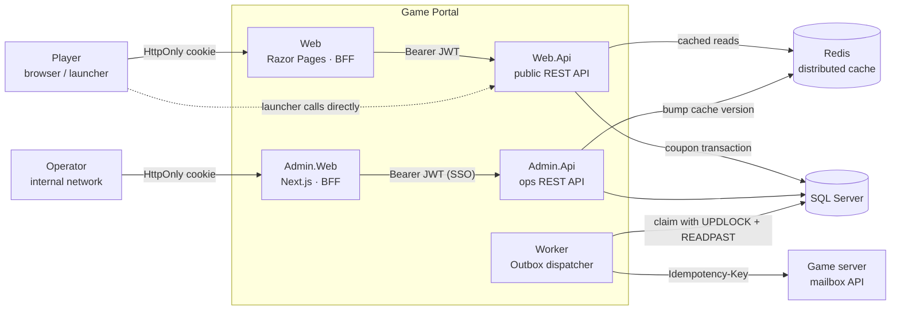
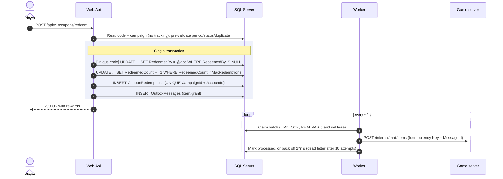
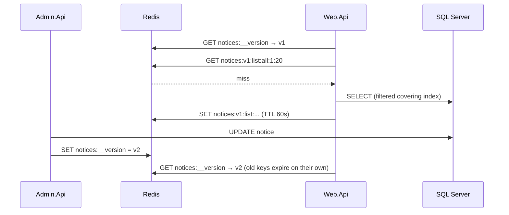
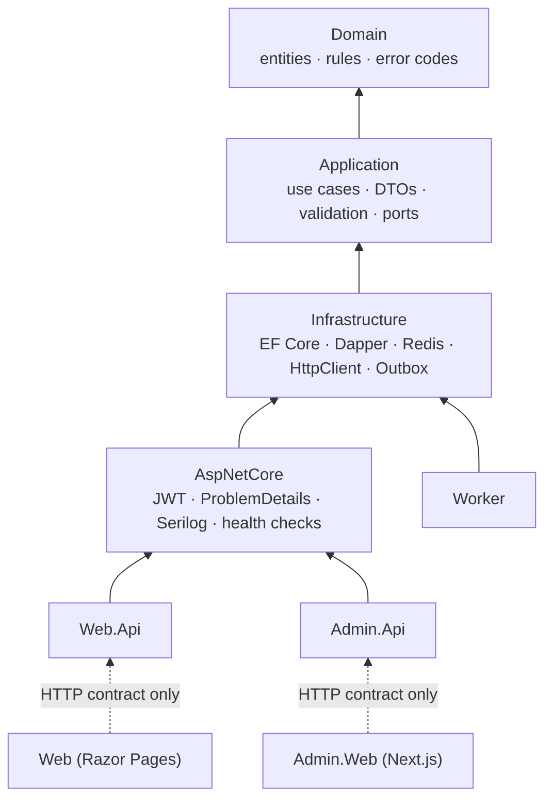
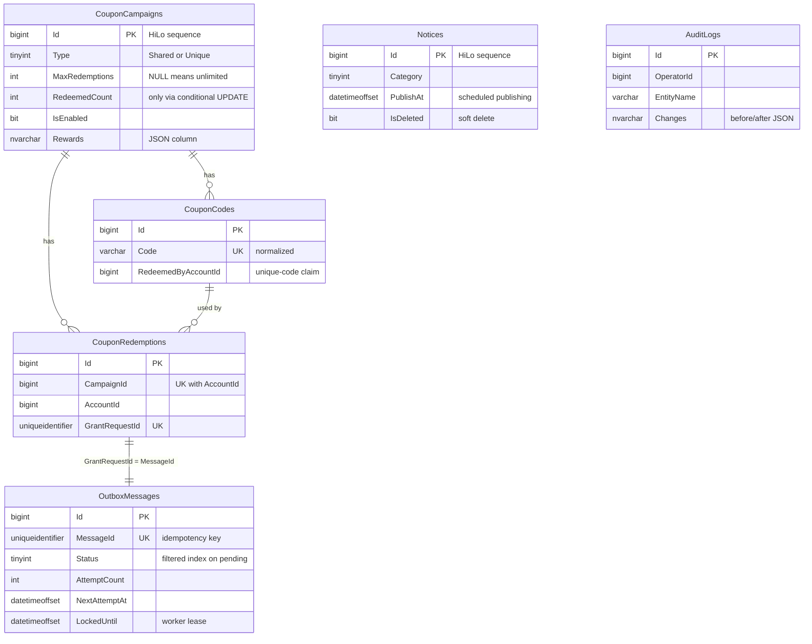
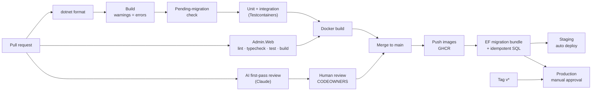

# Game Portal PoC

**English** | [한국어](README.ko.md)

[](https://github.com/hyunolike/game-portal-poc/actions/workflows/ci.yml)


A full-stack proof of concept for a **game website + operations (admin) tool**, built the way a production game-web team would build it.

It covers the two scenarios that define most game web services:

- **"Enter a coupon on the website, receive items in the in-game mailbox."** First-come-first-served limits must hold under concurrent load, and the reward must reach the game server exactly once.
- **"An operator publishes a notice, and the website shows it immediately."** Reads are heavily cached, but cache invalidation still has to be instant.

The fictional game is **ETHERFALL**. The UI is in Korean because the target service is a Korean game portal.

> The design rationale is in [docs/ARCHITECTURE.md](docs/ARCHITECTURE.md). The review guide is [docs/CODE_REVIEW.md](docs/CODE_REVIEW.md), and the development process is [CONTRIBUTING.md](CONTRIBUTING.md). These three documents are in Korean.

---

## Screenshots

### Game website (Razor Pages)

| Home | Coupon redemption |
|---|---|
|  |  |
| Pinned maintenance notices become a site-wide banner. | Rewards are shown by item name. Delivery happens asynchronously through the game mailbox. |

| Notice board | Notice detail | Error by code | Mobile |
|---|---|---|---|
|  |  |  |  |

### Operations tool (Next.js)

| Dashboard | Coupon campaign detail |
|---|---|
|  |  |
| Failed deliveries turn the first card red. | Usage against the cap, rewards, and each redemption's delivery status. One click disables the campaign. |

| Issue a coupon | CS lookup |
|---|---|
|  |  |
| Shared or unique codes (up to 100k). A summary confirmation appears before issuing. | Answers "I used a coupon but got nothing" from one account number. |

| Delivery monitoring (dead letters) | Audit log |
|---|---|
|  |  |
| Deliveries that failed all automatic retries, with a one-click requeue. | Every change to operational data, shown as before → after in human-readable form. |

<details>
<summary>More screens</summary>

| Login (dev, role picker) | Notice management | Notice edit | Campaign list |
|---|---|---|---|
|  |  |  |  |

</details>

---

## Architecture

### System overview



| Process | Responsibility | Scaling |
|---|---|---|
| **Web** | Player-facing pages: home, notice board, coupon redemption. Calls Web.Api only. | Stateless, horizontal |
| **Web.Api** | Notices (cached), coupon redemption, redemption history, rate limiting | Stateless, horizontal. Carries most of the traffic |
| **Admin.Web** | Ops UI. Server Components and Server Actions call Admin.Api on the server | Internal network, 1–2 instances |
| **Admin.Api** | Notice CRUD, coupon issuance (bulk), CS lookup, delivery retry, audit log, role-based access | Internal network, 1–2 instances |
| **Worker** | Delivers Outbox messages to the game server with retries | Horizontal. Row locks prevent double processing |

Why separate processes?
- **Security boundary.** Ops APIs never share a process with public APIs, so a routing mistake can't expose them.
- **Failure isolation.** Only the Worker talks to the game server, so a slow game server never slows down web responses.
- **Independent deploys.** An ops-tool feature doesn't require redeploying the servers that take player traffic.

### Coupon redemption: from the click to the in-game mailbox



| Rule | How it's enforced | Error code |
|---|---|---|
| First-come-first-served cap | Conditional `UPDATE` (atomic increment). 0 rows affected means sold out | `COUPON_SOLD_OUT` |
| A unique code is used once | Conditional `UPDATE` claims the code | `COUPON_ALREADY_USED` |
| One redemption per account | `UNIQUE (CampaignId, AccountId)` | `COUPON_ALREADY_REDEEMED` |
| No partial success | All of the above plus history and Outbox in one transaction | Roll back undoes the increment |
| No double delivery | Outbox `MessageId` is sent as the game server's idempotency key | 409 treated as success |

Why not call the game server inside the transaction? A slow game server would hold DB locks, and a commit failing after a successful call would give items away for free. Calling it after the commit loses rewards if the process dies. The **Transactional Outbox** avoids both problems.

### Notice caching and cross-process invalidation



- **No key scans.** Invalidation replaces a single version key instead of `SCAN` + `DEL`, which gets expensive on a busy Redis.
- **Fail-open.** If Redis is down, reads fall back to the database instead of failing the page.
- **Negative caching.** Unknown notice IDs are cached too, so crawlers can't hammer the DB.

### Code layers



The two front ends reference no server project. They depend only on the HTTP contract, so each can be deployed on its own.

### Data model



### CI/CD



Schema changes run as their own pipeline step, using the EF migration bundle and an idempotent SQL artifact that a DBA can review. Apps never migrate on startup outside local development.

---

## Key design decisions

| Area | Decision | Why |
|---|---|---|
| Concurrency | Conditional `UPDATE` and `UNIQUE` constraints instead of read-then-write | Read-then-write causes lost updates and over-issuing under a first-come-first-served rush |
| Integration | Transactional Outbox, idempotency key, two-level retry (Polly, then exponential backoff to a dead letter) | You can't have a distributed transaction between the web DB and the game server |
| Data access | EF Core for CRUD. Dapper only for the lock-hinted Outbox claim. No extra repository layer | `DbContext` is already a unit of work. Hiding `IQueryable` makes query tuning harder |
| Audit | A `SaveChangesInterceptor` writes audit rows in the same transaction. HiLo IDs make IDs known before `INSERT` | Hand-written audit calls get forgotten |
| Auth | Both front ends are BFFs: tokens live only in HttpOnly cookies and APIs are called server-side | XSS can't steal tokens, and API hosts aren't exposed to browsers |
| Errors | RFC 7807 ProblemDetails with a stable `code` and a `traceId` | Clients branch on codes, not message text. CS can quote the trace ID |
| Contracts | A unit test fails if the server adds a coupon error code that the website has no message for | Keeps front-end copy in sync with server contracts |
| Ops UX | Confirmation summaries, submit locking, KST everywhere, raw audit values translated | Operators make irreversible changes and need to read audits quickly |
| Localization | Korean line breaking (`word-break: keep-all`), no HTML entity encoding of Hangul | Common pitfalls on Korean sites. Both were found and fixed while building this |

### What this demonstrates

| Requirement | Where it shows up |
|---|---|
| Building and maintaining a game website | `src/GamePortal.Web` (SSR, responsive, SEO-friendly notices) + `src/GamePortal.Web.Api` |
| Building and maintaining an ops tool | `src/GamePortal.Admin.Web` (Next.js) + `src/GamePortal.Admin.Api` (roles, audit, bulk issuance, CSV streaming) |
| .NET 6+ web services | .NET 8, ASP.NET Core, EF Core 8, `IExceptionHandler`, `TimeProvider`, rate limiter, typed `HttpClient` + resilience |
| RDBMS development and operations | SQL Server: conditional updates, unique constraints, filtered/covering indexes, HiLo, JSON columns, `UPDLOCK + READPAST`, migrations |
| RESTful API design | Resource URLs, status-code conventions, ProblemDetails + error codes, paging, idempotency keys |
| Server architecture and data flow | Web / Admin / Worker split, Transactional Outbox, cache invalidation (diagrams above) |
| Git-based collaboration | GitHub Flow, Conventional Commits, PR template, CODEOWNERS, Dependabot |
| Code review culture, process improvement | Review checklist and comment levels, CI-enforced style, migration check |
| Large-scale web services | Concurrency-safe first-come-first-served, Redis caching, rate limiting, streaming, scaling roadmap |
| CI/CD automation | GitHub Actions CI/CD, GHCR images, migration bundle, staging auto-deploy, gated production |
| AI tools in day-to-day development | AI PR review workflow, `CLAUDE.md` agent conventions, AI usage guide in `CONTRIBUTING.md` |

---

## Quick start

```bash
docker compose up --build
```

| Service | URL | Notes |
|---|---|---|
| Game website | http://localhost:5000 | Dev login: enter any account number |
| Ops tool | http://localhost:3000 | Dev login: pick a role (Admin / Operator / CS) |
| Web API | http://localhost:5100/swagger | |
| Admin API | http://localhost:5200/swagger | Applies migrations on startup (local only) |
| Game server mock | http://localhost:5300 | Returns 503 20% of the time, to show the retry path |

Try the main flow:
1. In the ops tool, log in as **Admin**. Go to **쿠폰 캠페인 → 쿠폰 발행** and issue a shared code such as `OPEN2026`.
2. On the website, log in and redeem `open-2026` under **쿠폰 등록**. Case and hyphens don't matter.
3. Back in the ops tool, open **CS 조회**, enter the account number, and watch the delivery go from *지급 대기* to *지급 완료*.
4. Open **감사 로그** to see who issued the campaign and with which rewards.

<details>
<summary>Same flow with curl</summary>

```bash
ADMIN=$(curl -s -X POST localhost:5200/dev/token -H 'content-type: application/json' \
  -d '{"operatorId":1,"name":"ops","roles":["Admin"]}' | jq -r .accessToken)

curl -X POST localhost:5200/api/v1/coupon-campaigns -H "authorization: Bearer $ADMIN" -H 'content-type: application/json' -d '{
  "name":"Launch gift","type":"Shared","startsAt":"2026-01-01T00:00:00Z","endsAt":"2027-01-01T00:00:00Z",
  "maxRedemptions":100,"rewards":[{"itemId":1001,"quantity":100}],"sharedCode":"OPEN2026"}'

PLAYER=$(curl -s -X POST localhost:5100/dev/token -H 'content-type: application/json' -d '{"accountId":10001}' | jq -r .accessToken)
curl -X POST localhost:5100/api/v1/coupons/redeem -H "authorization: Bearer $PLAYER" \
  -H 'content-type: application/json' -d '{"code":"open-2026"}'

curl "localhost:5200/api/v1/coupon-redemptions?accountId=10001" -H "authorization: Bearer $ADMIN"
```
</details>

### Run locally with JetBrains Rider / WebStorm

The repository ships shared run configurations in [`.run/`](.run), so Rider picks them up automatically when you open `GamePortal.sln`.

**Prerequisites:** .NET 8 SDK, Node.js 22, Docker Desktop, and Rider (its bundled JavaScript support runs the Next.js app).

1. **Start the infrastructure.** Run **`0. Infra (SQL Server + Redis)`**, or `docker compose up -d sqlserver redis` in a terminal.
2. **Install front-end packages once:** `npm install` in `src/GamePortal.Admin.Web`. Rider also offers this when you open `package.json`.
3. **Start everything.** Run or debug **`All services`**. It launches these configurations:

| Run configuration | URL | Notes |
|---|---|---|
| `1. Admin.Api` | http://localhost:5200/swagger | Applies DB migrations on startup (Development only) |
| `2. Web.Api` | http://localhost:5100/swagger | |
| `3. Web (homepage)` | http://localhost:5000 | |
| `4. Worker` | – | Delivers coupon rewards to the mock game server |
| `5. GameServer.Mock` | http://localhost:5300 | |
| `6. Admin.Web (ops UI)` | http://localhost:3000 | `npm run dev`. Settings come from the committed `.env.development` |

4. **Try the flow from the IDE.** Open [`tools/http/demo.http`](tools/http/demo.http), select the `local` environment, and choose *Run All Requests in File*. It logs in, posts a notice, issues a coupon, redeems it, checks the CS view and the audit log, and asserts the expected status codes along the way.

Debugging works across services. Start `All services` in **Debug**, set breakpoints in, for example, `CouponRedeemService` and `OutboxProcessor`, and follow one coupon from the HTTP request to the game-server call.

<details>
<summary>Troubleshooting</summary>

- **Apple Silicon (M1–M4).** SQL Server 2022 only ships an x86-64 image. Enable *Docker Desktop → Settings → General → Use Rosetta for x86/amd64 emulation*.
- **"Docker" server not found in `0. Infra`.** Pick your Docker connection in the run configuration, or start the containers from a terminal.
- **Using WebStorm for the ops UI.** Open `src/GamePortal.Admin.Web` and run the `dev` script from `package.json`. The .NET services still need to run, either from Rider or with `docker compose up`.
- **Port already in use.** Stop `docker compose` app containers first. Locally, only `sqlserver` and `redis` should run in Docker.
- **SDK error from `global.json`.** Install a .NET 8 SDK. The repo pins major version 8.

</details>

---

## Tests

| Suite | Count | What it proves |
|---|---:|---|
| .NET unit (`tests/GamePortal.UnitTests`) | 56 | Domain rules and boundaries, validators, cache fail-open, front-end ↔ server error-code contract |
| .NET integration (`tests/GamePortal.IntegrationTests`) | 33 | Real SQL Server via Testcontainers. APIs **and** the Razor website run end to end in process |
| Admin.Web unit (`npm test`) | 13 | KST conversion, error mapping, role rules, audit value formatting |
| Admin.Web E2E (`npm run e2e`) | 4 | Playwright against the full running stack, including real Worker delivery |

Highlights:
- 40 concurrent players, 10 coupons: **exactly 10** succeed, and the rest get `COUPON_SOLD_OUT`.
- The same account fires 5 concurrent requests: one succeeds, and the counter increments of the others are **rolled back**.
- 4 Workers poll concurrently: every message is delivered **exactly once**.
- An operator edits a notice: the website cache is invalidated immediately, and the audit log records only the changed columns.
- Issue → player redeems → CS sees "지급 완료" → disable → audit log (E2E through the real UI).

```bash
dotnet test tests/GamePortal.UnitTests
dotnet test tests/GamePortal.IntegrationTests      # needs Docker

cd src/GamePortal.Admin.Web
npm test
npm run e2e                                        # needs the stack running (docker compose up)
```

---

## Project layout

```
src/
  GamePortal.Domain           Entities, business rules, error codes (no dependencies)
  GamePortal.Application      Use cases, DTOs, FluentValidation, ports
  GamePortal.Infrastructure   EF Core (SQL Server), Dapper, Redis, game-server client, Outbox, audit interceptor
  GamePortal.AspNetCore       Shared API hosting: JWT, ProblemDetails, Serilog, health checks, Swagger
  GamePortal.Web              Game website (Razor Pages, BFF)
  GamePortal.Web.Api          Public REST API (+ rate limiting)
  GamePortal.Admin.Web        Ops tool UI (Next.js App Router, BFF)
  GamePortal.Admin.Api        Ops REST API (+ role policies, audit)
  GamePortal.Worker           Outbox → game server delivery
tools/GameServer.Mock         Game mailbox API mock with failure injection
tools/http/demo.http          End-to-end demo scenario for the JetBrains HTTP Client
.run/                         Shared Rider run configurations (infra, each service, "All services")
tests/                        .NET unit and integration tests
docs/                         Architecture, code review guide, screenshots
.github/                      CI, CD, AI review, PR template, CODEOWNERS, Dependabot
```

## API summary

**Web API** (`/api/v1`)

| Method | Path | Description |
|---|---|---|
| GET | `/notices?category=&page=&pageSize=` | Notice list (pinned first) |
| GET | `/notices/{id}` | Notice detail |
| POST | `/coupons/redeem` | Redeem a coupon (auth, 10/min per account) |
| GET | `/coupons/history` | My redemption history (auth) |

**Admin API** (`/api/v1`). Roles: `CS` < `Operator` < `Admin`.

| Method | Path | Role |
|---|---|---|
| GET/POST/PUT/DELETE | `/notices[/{id}]` | Read: all. Write: Operator+ |
| GET | `/coupon-campaigns[/{id}]` | All |
| POST | `/coupon-campaigns` · `/{id}/disable` · `/{id}/enable` | Admin |
| GET | `/coupon-campaigns/{id}/codes.csv` | Admin (streamed) |
| GET | `/coupon-redemptions?accountId=&campaignId=` | All (CS lookup) |
| GET | `/outbox/stats` · `/outbox?status=` | Operator+ |
| POST | `/outbox/{id}/retry` | Admin |
| GET | `/audit-logs?entityName=&entityId=&operatorId=&from=&to=` | Admin |

Error format (RFC 7807):

```json
{ "status": 409, "code": "COUPON_SOLD_OUT", "title": "선착순 수량이 모두 소진되었습니다.",
  "instance": "/api/v1/coupons/redeem", "traceId": "4bf92f3577b34da6a3ce929d0e0e4736" }
```

---

## Engineering process

- **Style is enforced by machines.** `.editorconfig` plus `dotnet format` and warnings-as-errors in CI, and ESLint with zero warnings for the front end. Reviews focus on design.
- **AI-assisted development.** Every PR gets a first-pass review from Claude, using the checklist in [docs/CODE_REVIEW.md](docs/CODE_REVIEW.md). [CLAUDE.md](CLAUDE.md) gives coding agents the same conventions humans follow. The PR template asks authors to disclose AI usage.
- **Safe schema changes.** CI fails when entities change without a migration. Migrations ship as a bundle with a reviewable idempotent SQL script.
- **Repo hygiene.** GitHub Flow, Conventional Commits, CODEOWNERS on money-sensitive paths, Dependabot.

## Out of scope for this PoC

- Real SSO / game-platform login. Switching over only needs `Jwt:Authority`. Locally, dev tokens are used.
- Running the Playwright E2E suite in CI. It needs the full stack, so it runs locally for now.
- Kubernetes manifests and IaC. The CD workflow defines the rollout steps behind a `DEPLOY_ENABLED` switch.
