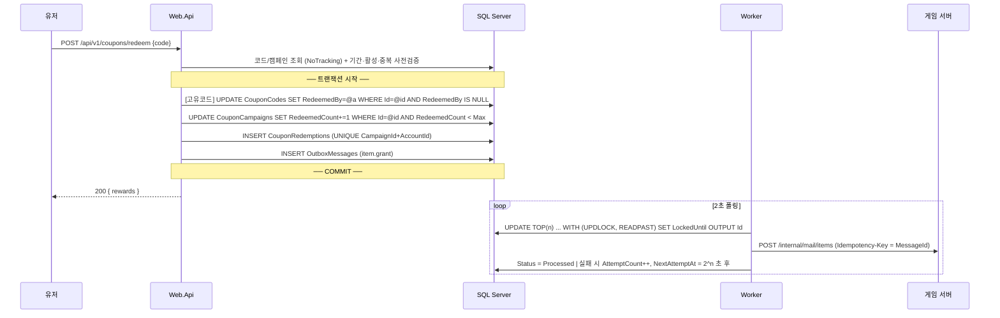
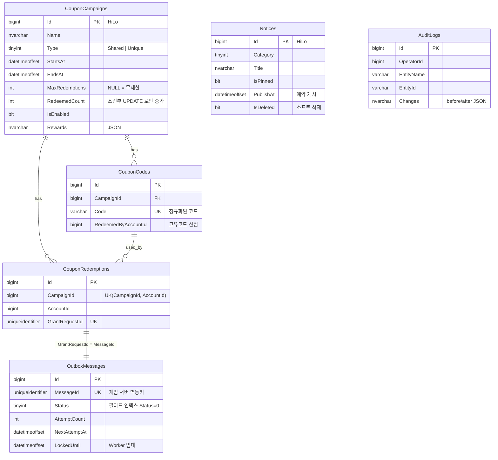
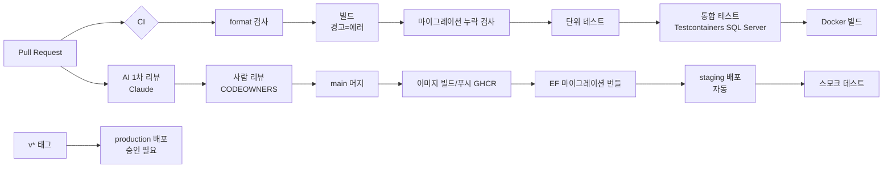

# 아키텍처 설계서

게임 홈페이지 + 운영툴 백엔드 PoC. "쿠폰 입력 → 게임 내 우편함 지급"이라는 게임 웹의 대표 시나리오를
실무 수준의 동시성·정합성·운영성으로 구현하는 것을 목표로 한다.

## 1. 시스템 구성

```mermaid
flowchart LR
    subgraph Client
        U[유저 브라우저 / 런처]
        O[운영자 (사내망)]
    end

    subgraph GamePortal
        W[Web.Api<br/>유저 대면]
        A[Admin.Api<br/>운영툴]
        K[Worker<br/>Outbox Dispatcher]
    end

    DB[(SQL Server<br/>PortalDb)]
    R[(Redis<br/>분산 캐시)]
    G[게임 서버<br/>우편함 API]

    U -- JWT(게임 플랫폼) --> W
    O -- JWT(사내 SSO) --> A
    W --> DB
    W --> R
    A --> DB
    A -- 캐시 무효화 --> R
    K -- 폴링/임대 --> DB
    K -- Idempotency-Key --> G
```

| 프로세스 | 역할 | 스케일 전략 |
|---|---|---|
| **Web.Api** | 공지 조회, 쿠폰 사용, 내 쿠폰 내역 | 수평 확장 (무상태). 트래픽 대부분 |
| **Admin.Api** | 공지 CRUD, 쿠폰 발행/중지/CSV 추출, CS 조회, 지급 실패 재처리, 감사 로그 | 1~2대. 사내망 전용 |
| **Worker** | Outbox → 게임 서버 전달 | 수평 확장 가능 (행 잠금 기반 분산 처리) |

### 왜 Web / Admin 을 분리했나
- **보안 경계**: 운영툴은 사내망 + SSO + 역할 기반 권한. 유저 API 와 같은 프로세스에 두면 라우팅 실수 하나로 운영 API 가 외부에 노출된다.
- **배포 독립성**: 운영툴 기능 추가가 유저 트래픽을 받는 서버 재배포를 유발하지 않는다.
- **공통 코드**는 `GamePortal.AspNetCore`(인증/에러/로깅/헬스체크)와 `Application`(유스케이스)으로 공유해 중복을 없앴다.

## 2. 레이어 구조

```
Domain          ← 엔티티, 비즈니스 규칙, 에러 코드. 외부 의존성 0
Application     ← 유스케이스 서비스, DTO, 검증(FluentValidation), 포트(인터페이스)
Infrastructure  ← EF Core, Dapper, Redis, HttpClient(게임 서버), Outbox 처리기
AspNetCore      ← 두 API 공통 호스팅 구성
Web.Api / Admin.Api / Worker ← 조립(Composition root) + Controller
```

- **Repository 패턴을 한 겹 더 두지 않았다.** EF Core `DbContext` 자체가 Repository + Unit of Work 이고,
  `IQueryable` 을 감추면 프로젝션/인덱스 튜닝이 어려워진다. 대신 `IPortalDbContext` 인터페이스로 경계를 둔다.
- **EF Core + Dapper 혼용**: 일반 CRUD 는 EF, 락 힌트/OUTPUT 절이 필요한 Outbox 선점 쿼리만 Dapper.
- **DB 벤더 예외 번역**: `SqlException(2601/2627)` → `UniqueConstraintViolationException`. Application 은 SQL Server 에러 번호를 모른다.

## 3. 핵심 시나리오: 쿠폰 사용



### 3.1 동시성: 왜 "조회 후 검증"이 아니라 "조건부 UPDATE"인가

선착순 100개 쿠폰에 동시에 1,000명이 요청하면, 애플리케이션에서
`if (campaign.RedeemedCount < Max) campaign.RedeemedCount++` 는 **Lost Update** 로 초과 지급된다.

| 보장해야 할 규칙 | 구현 | 비고 |
|---|---|---|
| 총 수량 제한 | `UPDATE ... WHERE RedeemedCount < MaxRedemptions` → 영향 행 0 이면 SOLD_OUT | 원자적 증가 |
| 고유 코드 1회 | `UPDATE ... WHERE RedeemedByAccountId IS NULL` → 0 이면 ALREADY_USED | 낙관적 선점 |
| 계정당 1회 | `UNIQUE (CampaignId, AccountId)` 위반 → ALREADY_REDEEMED | 더블클릭/매크로 방어 |
| 부분 성공 금지 | 위 3개 + 이력 + Outbox 를 하나의 트랜잭션 | 실패 시 수량 증가도 롤백 |

통합 테스트 `선착순_수량을_초과해_지급되지_않는다`가 실제 SQL Server 에서 40명 동시 요청 → 정확히 10명 성공을 검증한다.

**트레이드오프**: 캠페인 행이 핫스팟이 되어 같은 캠페인의 요청은 커밋까지 직렬화된다.
수천 TPS 규모의 이벤트라면 Redis `DECR` 로 1차 수량 게이트를 두고 DB 는 최종 기록만 하는 방식,
또는 카운터를 N개 행으로 샤딩하는 방식을 검토한다 (§6).

### 3.2 게임 서버 연동: Transactional Outbox

"DB 커밋"과 "게임 서버 HTTP 호출"은 하나의 트랜잭션으로 묶을 수 없다.

| 방식 | 문제 |
|---|---|
| 트랜잭션 안에서 게임 서버 호출 | 게임 서버가 느리면 DB 락 유지 시간 증가 → 전체 쿠폰 API 지연. 호출 성공 후 커밋 실패 시 **무상 지급** |
| 커밋 후 호출 | 호출 실패/프로세스 종료 시 **지급 누락** (유저는 "사용됨"인데 아이템 없음) |
| **Outbox (채택)** | 지급 요청을 같은 트랜잭션에 기록 → Worker 가 at-least-once 전달. 게임 서버는 `Idempotency-Key` 로 중복 제거 |

- **다중 Worker**: `UPDLOCK + READPAST` 로 다른 Worker 가 잡은 행은 건너뛰고, `LockedUntil` 임대로 Worker 가 죽어도 일정 시간 후 재처리된다.
- **재시도**: HTTP 레벨(Polly, 짧게 2회) + Outbox 레벨(지수 백오프 2^n초, 최대 10분, 10회) 2단.
- **Dead letter**: 10회 실패 시 `Failed` → 운영툴 `/api/v1/outbox` 에서 확인 후 수동 재시도. 에러 로그 레벨로 알람 연동.
- **CS 대응**: `/api/v1/coupon-redemptions?accountId=` 가 사용 이력과 지급 상태(Pending/Processed/Failed)를 함께 보여준다.

## 4. 공지사항 캐시 전략

- 조회 트래픽 ≫ 쓰기. 점검/업데이트 공지 시점에 트래픽이 수십 배로 몰린다.
- `IDistributedCache`(Redis) + **리전 버전 키** 무효화:
  `notices:{version}:list:...` 형태로 저장하고, 운영툴에서 공지를 바꾸면 `notices:__version` 만 교체한다.
  키 패턴 삭제(`SCAN`+`DEL`)는 Redis 부하가 커서 쓰지 않는다. 구버전 키는 TTL(60초)로 자연 소멸.
- **Fail-open**: Redis 장애 시 예외를 삼키고 DB 로 폴백 (캐시 장애가 서비스 장애로 번지지 않게).
- **Negative caching**: 없는 공지 ID 도 캐싱해 크롤러의 반복 조회를 흡수.
- 예약 공지는 최대 TTL(60초)만큼 늦게 노출될 수 있음 → 운영 합의 사항으로 문서화.
- 추가로 `Cache-Control: public, max-age=10` 을 내려 CDN 에서 1차 흡수.

## 5. 운영툴 설계

| 역할 | 공지 | 쿠폰 조회 | 쿠폰 발행/중지/CSV | 지급 모니터링 | 지급 재처리 | 감사 로그 |
|---|---|---|---|---|---|---|
| CS | 조회 | ✅ | ❌ | ❌ | ❌ | ❌ |
| Operator | ✅ | ✅ | ❌ | ✅ | ❌ | ❌ |
| Admin | ✅ | ✅ | ✅ | ✅ | ✅ | ✅ |

- **FallbackPolicy**: 정책을 명시하지 않은 엔드포인트도 기본으로 직원 인증을 요구 → "실수로 열린 API" 방지.
  (헬스체크는 명시적 `AllowAnonymous` — 통합 테스트로 회귀 방지)
- **감사 로그 자동화**: `IAuditableEntity` 변경을 `SaveChangesInterceptor` 가 수집해 **같은 트랜잭션**으로 기록.
  Added 엔티티도 Id 가 필요하므로 해당 엔티티는 **HiLo 시퀀스**로 INSERT 전에 Id 를 확정한다.
  수정 시에는 바뀐 컬럼의 before/after 만 저장.
- **대량 코드 발행**: 10만 건을 `SqlBulkCopy` 로 같은 트랜잭션에 INSERT. 코드 생성(CPU)은 트랜잭션 밖에서.
- **CSV 추출**: `IAsyncEnumerable` 스트리밍으로 메모리에 전체를 올리지 않는다.

## 6. 대용량 대비 (PoC 범위 밖, 확장 로드맵)

| 이슈 | 현재 | 확장 방안 |
|---|---|---|
| 선착순 핫 로우 | 캠페인 행 조건부 UPDATE | Redis `DECR` 1차 게이트 → DB 최종 기록 / 카운터 샤딩 |
| 캐시 스탬피드 | TTL 만료 시 동시 DB 조회 가능 | .NET 9 `HybridCache`(요청 병합) 또는 조기 갱신 |
| 읽기 부하 | 단일 DB | Always On 읽기 전용 복제본 → 조회 서비스는 `ApplicationIntent=ReadOnly` |
| Outbox 테이블 증가 | 필터드 인덱스로 대기 건만 인덱싱 | 처리 완료 건 파티션 스위칭/배치 삭제 잡 |
| 대량 코드 발행 | 동기 API (최대 10만) | 백그라운드 잡 + 진행률 조회 |
| 코드 대입 공격 | 계정당 분당 10회 Rate limit | 실패 횟수 기반 일시 차단, CAPTCHA, WAF |

## 7. 데이터 모델



## 8. 배포 파이프라인



- **스키마 변경과 앱 배포 분리**: 앱 기동 시 자동 마이그레이션은 로컬에서만. 운영은 CD 의 마이그레이션 번들 단계에서 실행하고,
  `migration.sql`(idempotent)을 아티팩트로 남겨 DBA 리뷰가 가능하게 한다.
- **Expand/Contract**: 컬럼 삭제·이름 변경은 (1) 새 컬럼 추가 + 양쪽 쓰기 배포 → (2) 구 컬럼 제거의 2단계. 롤링 배포 중 구버전 파드가 살아있기 때문.
- **헬스체크 분리**: `/health/live`(프로세스 생존, 의존성 미확인) / `/health/ready`(DB·Redis 확인). DB 장애 시 파드가 재시작 루프에 빠지지 않고 LB 에서만 빠진다.
